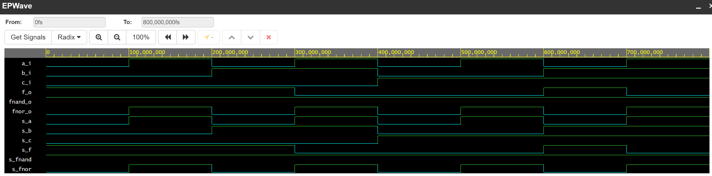

# 01-gates

1. [Repository link](https://github.com/NechTaSilaSprevadza/Digital-electronics-1)

2. Verification of De Morgan's laws of function f(c,b,a)

* Logical equations


* Table with logical values

| **c** | **b** |**a** | **f(c,b,a)** |
| :-: | :-: | :-: | :-: |
| 0 | 0 | 0 | 1 |
| 0 | 0 | 1 | 1 |
| 0 | 1 | 0 | 1 |
| 0 | 1 | 1 | 0 |
| 1 | 0 | 0 | 0 |
| 1 | 0 | 1 | 0 |
| 1 | 1 | 0 | 1 |
| 1 | 1 | 1 | 0 |

* Listing of VHDL code `design.vhd`

```bash
------------------------------------------------------------------------
--
-- Example of basic OR, AND, XOR gates.
-- Nexys A7-50T, Vivado v2020.1, EDA Playground
--
-- Copyright (c) 2020-2021 Adam Budac - student
-- Copyright (c) 2019-2020 Tomas Fryza - teacher
-- Dept. of Radio Electronics, Brno University of Technology, Czechia
-- This work is licensed under the terms of the MIT license.
--
------------------------------------------------------------------------

library ieee;               -- Standard library
use ieee.std_logic_1164.all;-- Package for data types and logic operations

------------------------------------------------------------------------
-- Entity declaration for basic gates
------------------------------------------------------------------------
entity gates is
    port(
        a_i     : in  std_logic;         -- Data input
        b_i     : in  std_logic;         -- Data input
        c_i     : in  std_logic;         -- Data input
--        for_o   : out std_logic;         -- OR output function
--        fand_o  : out std_logic;         -- AND output function
--        fxor_o  : out std_logic          -- XOR output function
        f_o     : out std_logic;         -- output function
        fnand_o : out std_logic;         -- NAND output function
        fnor_o  : out std_logic          -- NOR output function
);
end entity gates;

------------------------------------------------------------------------
-- Architecture body for basic gates
------------------------------------------------------------------------
architecture dataflow of gates is
begin
--    for_o  <= a_i or b_i;
--    fand_o <= a_i and b_i;
--    fxor_o <= a_i xor b_i;
    f_o     <= (b_i and not(a_i)) or (not(c_i) and not(b_i));
    fnand_o <= not(b_i and (not(a_i)) and (not(c_i)) and (not(b_i)));
    fnor_o  <= not(b_i or (not(a_i))) or not (not(b_i) or (not(a_i)));
    
end architecture dataflow;
```

* Screenshot with simulated time waveforms



* Link to public EDA Playground example: [Playground](https://www.edaplayground.com/x/AwWm)

2. Verification of Distributive laws

* Listing of VHDL code `design.vhd`

```bash

```

* Screenshot with simulated time waveforms


* Link to public EDA Playground example: [Playground]()


