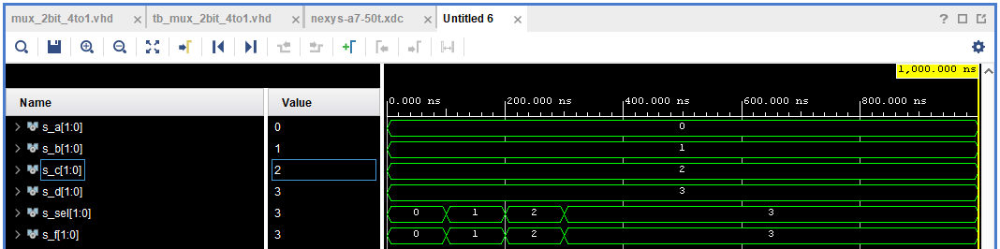

# 03-vivado

1. Preparation tasks

* Nexys A7 board


2. Two-bit wide 4-to-1 multiplexer


* VHDL architecture mux_2bit_4to1.vhd

```bash
------------------------------------------------------------------------
-- Architecture body for muxer
------------------------------------------------------------------------
architecture Behavioral of mux_2bit_4to1 is
begin
    f_o <= a_i when (sel_i = "00") else
           b_i when (sel_i = "01") else
           c_i when (sel_i = "10") else
           d_i;
end architecture Behavioral;
```


* VHDL stimulus process tb_mux_2bit_4to1.vhd

```bash
    --------------------------------------------------------------------
    -- Data generation process
    --------------------------------------------------------------------
    p_stimulus : process
    begin
        s_sel <= "00"; s_d <= "11"; s_c <= "10"; s_b <= "01"; s_a <= "00"; wait for 100 ns;
        s_sel <= "01"; s_d <= "11"; s_c <= "10"; s_b <= "01"; s_a <= "00"; wait for 100 ns;
        s_sel <= "10"; s_d <= "11"; s_c <= "10"; s_b <= "01"; s_a <= "00"; wait for 100 ns;
        s_sel <= "11"; s_d <= "11"; s_c <= "10"; s_b <= "01"; s_a <= "00"; wait for 100 ns;
        wait;
    end process p_stimulus;
```


* Screenshot with simulated time waveforms




3. A Vivado tutorial

```bash

---- !!!! Začiatok !!!! ----

File -> Project New -> Next

Project name: comparator, multiplexer (alebo niečo výstižné)

Project location: D:/Adam/Dokumenty/kola/VUT/semester 6/digitalka 1/cvika/Repozitar/Digital-electronics-1/Labs/0x-XYZ

Create project subdirectory: odfajknuté -> Next

RTL Project, ďalej nič neodfajknuté -> Next

Target language: VHDL

Simulator language: VHDL

Add sources: Create File -> File type: VHDL

                            File name: comparator_2bit, mux_2bit_4to1 (je to v podstate design.vhd) -> OK -> Next

Add constraints: -> Next

Default Part: Boards -> Search -> Nexys A7-50T -> klik do jeho okna na zvýraznenie -> Next -> Finish

Define module: Entity name: comparator_2bit, mux_2bit_4to1 (je to v podstate design.vhd)

               Architecture name: Behavioral comparator_2bit, mux_2bit_4to1 (je to v podstate design.vhd) -> OK

Sources: Design sources: XYZ(design).vhd (vytvoreny design)

         + -> Add or create simulation sources -> Next -> Create file -> File type: VHDL

         File name: tb_comparator_2bit, tb_mux_2bit_4to1 (je to v podstate testbench.vhd) -> OK -> Finish

Define Module: Entity name: tb_comparator_2bit, tb_mux_2bit_4to1 (je to v podstate testbench.vhd) -> OK -> Yes (ak sa opýta)
		
Sources: Simulation sources: tb_XYZ(testbench).vhd (vytvoreny testbench)

napísať program pre design.vhd a testbench.vhd, po dvojkliku na XYZ.vhd sa to otvorí na edit, kde sa to dá hneď uložiť disketkou

Simulation -> Run Simulation -> Run Behavioral Simulation -> Zoom fit

Sources: + -> Add or create constraints -> Next -> Create file -> File type: VHDL

                                                                  File name: nexys-a7-50t (cpu na vyvojovom kite.xdc) -> OK -> Finish

Constraints: nexys-a7-50t.xdc (sluzi na definovanie pouzitych pinov na vyvojovom kite)

definovať použité piny nexys-a7-50t.xdc, po dvojkliku na sa to otvorí na edit, kde sa to dá hneď uložiť disketkou

Program and Debug -> Generate bitstream -> OK (Zobrazenie priebehu na Project summary, nasjkôr prebehne syntéza a implementácia) -> Bitstream generation completed: 

                     Open Hardware Manager -> Open target -> Next -> Next -> Finish

                                              Open target -> Auto connect -> Hardware: nexysXYZ -> Program device -> Bitstream file -> Program -> OK

---- !!!! Hotovo !!!! ----

```


