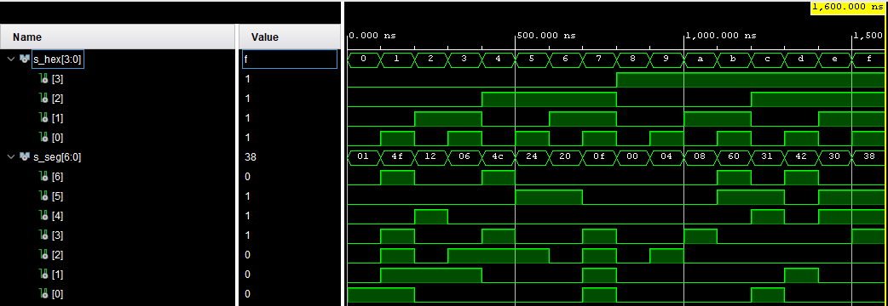
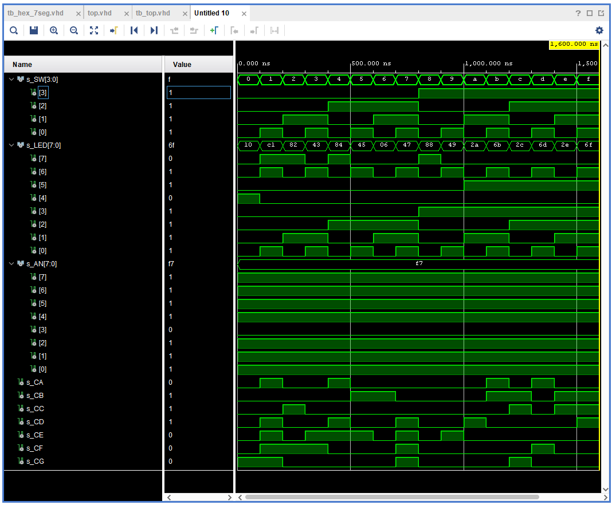

# 04-segment

1. Preparation tasks

* Nexys A7 board


* Decoder truth table

| **HEX** | **Inputs** | **A** | **B** | **C** | **D** | **E** | **F** | **G** |
| :-: | :-: | :-: | :-: | :-: | :-: | :-: | :-: | :-: |
| 0 | 0000 | 0 | 0 | 0 | 0 | 0 | 0 | 1 |
| 1 | 0001 | 1 | 0 | 0 | 1 | 1 | 1 | 1 |
| 2 | 0010 | 0 | 0 | 1 | 0 | 0 | 1 | 0 |
| 3 | 0011 | 0 | 0 | 0 | 0 | 1 | 1 | 0 |
| 4 | 0100 | 1 | 0 | 0 | 1 | 1 | 0 | 0 |
| 5 | 0101 | 0 | 1 | 0 | 0 | 1 | 0 | 0 |
| 6 | 0110 | 0 | 1 | 0 | 0 | 0 | 0 | 0 |
| 7 | 0111 | 0 | 0 | 0 | 1 | 1 | 1 | 1 |
| 8 | 1000 | 0 | 0 | 0 | 0 | 0 | 0 | 0 |
| 9 | 1001 | 0 | 0 | 0 | 0 | 1 | 0 | 0 |
| A | 1010 | 0 | 0 | 0 | 1 | 0 | 0 | 0 |
| b | 1011 | 1 | 1 | 0 | 0 | 0 | 0 | 0 |
| C | 1100 | 0 | 1 | 1 | 0 | 0 | 0 | 1 |
| d | 1101 | 1 | 0 | 0 | 0 | 0 | 1 | 0 |
| E | 1110 | 0 | 1 | 1 | 0 | 0 | 0 | 0 |
| F | 1111 | 0 | 1 | 1 | 1 | 0 | 0 | 0 |


2. Seven-segment display decoder


* VHDL architecture hex_7seg.vhd

```vhdl
------------------------------------------------------------------------
-- Architecture body for seven-segment display decoder
------------------------------------------------------------------------
architecture behavioral of hex_7seg is
begin
    --------------------------------------------------------------------
    -- p_7seg_decoder:
    -- A combinational process for 7-segment display decoder. 
    -- Any time "hex_i" is changed, the process is "executed".
    -- Output pin seg_o(6) corresponds to segment A, seg_o(5) to B, etc.
    --------------------------------------------------------------------
    p_7seg_decoder : process(hex_i)
    begin
        case hex_i is
            when "0000" => seg_o <= "0000001";     -- 0
            when "0001" => seg_o <= "1001111";     -- 1
            when "0010" => seg_o <= "0010010";     -- 2
            when "0011" => seg_o <= "0000110";     -- 3
            when "0100" => seg_o <= "1001100";     -- 4
            when "0101" => seg_o <= "0100100";     -- 5
            when "0110" => seg_o <= "0100000";     -- 6
            when "0111" => seg_o <= "0001111";     -- 7
            when "1000" => seg_o <= "0000000";     -- 8
            when "1001" => seg_o <= "0000100";     -- 9
            when "1010" => seg_o <= "0001000";     -- A
            when "1011" => seg_o <= "1100000";     -- b
            when "1100" => seg_o <= "0110001";     -- C
            when "1101" => seg_o <= "1000010";     -- d
            when "1110" => seg_o <= "0110000";     -- E
            when others => seg_o <= "0111000";     -- F
        end case;
    end process p_7seg_decoder;

end architecture behavioral;
```


* VHDL stimulus process tb_hex_7seg.vhd

```vhdl
    --------------------------------------------------------------------
    -- Data generation process
    --------------------------------------------------------------------
    p_stimulus : process
    begin
        s_hex <= "0000"; wait for 100 ns;
        s_hex <= "0001"; wait for 100 ns;
        s_hex <= "0010"; wait for 100 ns;
        s_hex <= "0011"; wait for 100 ns;
        s_hex <= "0100"; wait for 100 ns;
        s_hex <= "0101"; wait for 100 ns;
        s_hex <= "0110"; wait for 100 ns;
        s_hex <= "0111"; wait for 100 ns;
        s_hex <= "1000"; wait for 100 ns;
        s_hex <= "1001"; wait for 100 ns;
        s_hex <= "1010"; wait for 100 ns;
        s_hex <= "1011"; wait for 100 ns;
        s_hex <= "1100"; wait for 100 ns;
        s_hex <= "1101"; wait for 100 ns;
        s_hex <= "1110"; wait for 100 ns;
        s_hex <= "1111"; wait for 100 ns;
        wait;
    end process p_stimulus;
```


* Screenshot with simulated time waveforms




* VHDL code top.vhd

```vhdl
------------------------------------------------------------------------
--
-- Copyright (c) 2020-2021 Adam Budac - student
-- Copyright (c) 2019-2020 Tomas Fryza - teacher
-- Dept. of Radio Electronics, Brno University of Technology, Czechia
-- This work is licensed under the terms of the MIT license.
--
------------------------------------------------------------------------

library ieee;
use ieee.std_logic_1164.all;

entity top is
    port(
        SW         : in   std_logic_vector(4 - 1 downto 0);
        LED        : out  std_logic_vector(8 - 1 downto 0);
        CA         : out  std_logic;
        CB         : out  std_logic;
        CC         : out  std_logic;
        CD         : out  std_logic;
        CE         : out  std_logic;
        CF         : out  std_logic;
        CG         : out  std_logic;
        AN         : out  std_logic_vector(8 - 1 downto 0)
    );
end top;

------------------------------------------------------------------------
-- Architecture body for top level
------------------------------------------------------------------------
architecture behavioral of top is
begin

    --------------------------------------------------------------------
    -- Instance (copy) of hex_7seg entity
    hex2seg : entity work.hex_7seg
        port map(
            hex_i    => SW,
            seg_o(6) => CA,
            seg_o(5) => CB,
            seg_o(4) => CC,
            seg_o(3) => CD,
            seg_o(2) => CE,
            seg_o(1) => CF,
            seg_o(0) => CG
        );

    -- Connect one common anode to 3.3V
    AN <= b"1111_0111";

    -- Display input value
    LED(3 downto 0) <= SW;

end architecture behavioral;
```


3. LED(7:4) indicators

* Truth table and listing of VHDL code for LEDs(7:4)

| **HEX** | **Inputs** | **LED4** | **LED5** | **LED6** | **LED7** |
| :-: | :-: | :-: | :-: | :-: | :-: |
| 0 | 0000 | 1 | 0 | 0 | 0 |
| 1 | 0001 | 0 | 0 | 1 | 1 |
| 2 | 0010 | 0 | 0 | 0 | 1 |
| 3 | 0011 | 0 | 0 | 1 | 0 |
| 4 | 0100 | 0 | 0 | 0 | 1 |
| 5 | 0101 | 0 | 0 | 1 | 0 |
| 6 | 0110 | 0 | 0 | 0 | 0 |
| 7 | 0111 | 0 | 0 | 1 | 0 |
| 8 | 1000 | 0 | 0 | 0 | 1 |
| 9 | 1001 | 0 | 0 | 1 | 0 |
| A | 1010 | 0 | 1 | 0 | 0 |
| b | 1011 | 0 | 1 | 1 | 0 |
| C | 1100 | 0 | 1 | 0 | 0 |
| d | 1101 | 0 | 1 | 1 | 0 |
| E | 1110 | 0 | 1 | 0 | 0 |
| F | 1111 | 0 | 1 | 1 | 0 |


```vhdl
    -- Turn LED(4) on if input value is equal to 0, ie "0000"
    LED(4) <= '1' when (SW = "0000") else '0';

    -- Turn LED(5) on if input value is greater than 9
    LED(5) <= '1' when (SW > "1001") else '0';

    -- Turn LED(6) on if input value is odd, ie 1, 3, 5, ...
    LED(6) <= '1' when ((SW = "0001")
                  or    (SW = "0011")
                  or    (SW = "0101")
                  or    (SW = "0111")
                  or    (SW = "1001")
                  or    (SW = "1011")
                  or    (SW = "1101")
                  or    (SW = "1111")) 
                  else '0';

    -- Turn LED(7) on if input value is a power of two, ie 1, 2, 4, or 8
    LED(7) <= '1' when ((SW = "0001")
                  or    (SW = "0010") 
                  or    (SW = "0100") 
                  or    (SW = "1000")) 
                  else '0';
```

* Screenshot with simulated time waveforms




