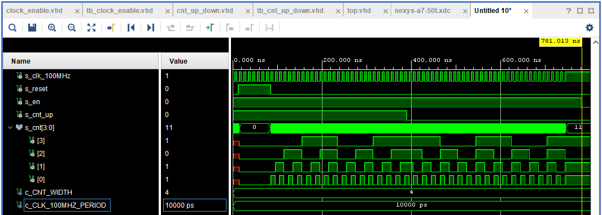
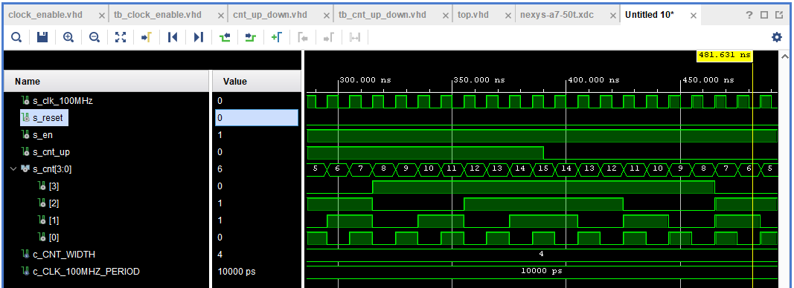
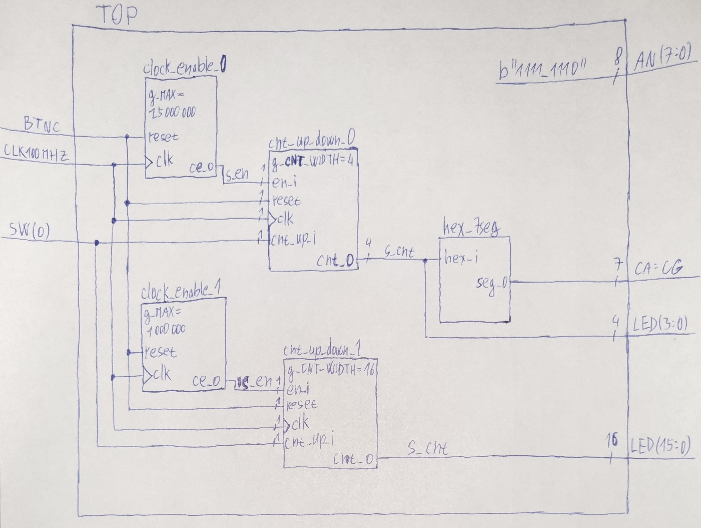

# 05-counter

1. Preparation tasks

* Nexys A7 board


* Table with calculated values

| **Time interval** | **Number of clk periods** | **Number of clk periods in hex** | **Number of clk periods in binary** |
| :-: | :-: | :-: | :-: |
| 2 ms | 200 000 | x"3_0D40" | b"0011_0000_1101_0100_0000" |
| 4 ms | 400 000 | x"6_1A80" | b"0110_0001_1010_1000_0000" |
| 10 ms | 1 000 000 | x"F_4240" | b"1111_0100_0010_0100_0000" |
| 250 ms | 25 000 000 | x"17D_7840" | b"0001_0111_1101_0111_1000_0100_0000" |
| 500 ms | 50 000 000 | x"2FA_F080" | b"0010_1111_1010_1111_0000_1000_0000" |
| 1 sec | 100 000 000 | x"5F5_E100" | b"0101_1111_0101_1110_0001_0000_0000" |


2. Bidirectional counter


* VHDL process `p_cnt_up_down`

```vhdl
    p_cnt_up_down : process(clk)
    begin
        if rising_edge(clk) then
        
            if (reset = '1') then               -- Synchronous reset
                s_cnt_local <= (others => '0'); -- Clear all bits

            elsif (en_i = '1') then       -- Test if counter is enabled

                -- TEST COUNTER DIRECTION HERE
                if (cnt_up_i = '1') then s_cnt_local <= s_cnt_local + 1;
                elsif (cnt_up_i = '0') then s_cnt_local <= s_cnt_local - 1;
                end if;
                
            end if;
        end if;
    end process p_cnt_up_down;
```


* VHDL reset and stimulus processes `tb_cnt_up_down.vhd`

```vhdl
    --------------------------------------------------------------------
    -- Reset generation process
    --------------------------------------------------------------------
    p_reset_gen : process
    begin
        s_reset <= '0';
        wait for 12 ns;
        s_reset <= '1';                 -- Reset activated
        wait for 73 ns;
        s_reset <= '0';
        wait;
    end process p_reset_gen;

    --------------------------------------------------------------------
    -- Data generation process
    --------------------------------------------------------------------
    p_stimulus : process
    begin
        report "Stimulus process started" severity note;

        s_en     <= '1';                -- Enable counting
        s_cnt_up <= '1';
        wait for 390 ns;                -- Change counter direction
        s_cnt_up <= '0';
        wait for 390 ns;
        s_en     <= '0';                -- Disable counting

        report "Stimulus process finished" severity note;
        wait;
    end process p_stimulus;
```


* Screenshot with simulated time waveforms






3. Top level


* VHDL code `top.vhd` 4-bit bidirectional counter

```vhdl
------------------------------------------------------------------------
--
-- Copyright (c) 2020-2021 Adam Budac - student
-- Copyright (c) 2019-2020 Tomas Fryza - teacher
-- Dept. of Radio Electronics, Brno University of Technology, Czechia
-- This work is licensed under the terms of the MIT license.
--
------------------------------------------------------------------------


library IEEE;
use IEEE.STD_LOGIC_1164.ALL;

-- Uncomment the following library declaration if using
-- arithmetic functions with Signed or Unsigned values
--use IEEE.NUMERIC_STD.ALL;

-- Uncomment the following library declaration if instantiating
-- any Xilinx leaf cells in this code.
--library UNISIM;
--use UNISIM.VComponents.all;

entity top is
    Port ( CLK100MHZ : in  STD_LOGIC;
           BTNC      : in  STD_LOGIC;
           SW        : in  STD_LOGIC_VECTOR (1 - 1 downto 0);
           LED       : out STD_LOGIC_VECTOR (4 - 1 downto 0);
           CA        : out STD_LOGIC;
           CB        : out STD_LOGIC;
           CC        : out STD_LOGIC;
           CD        : out STD_LOGIC;
           CE        : out STD_LOGIC;
           CF        : out STD_LOGIC;
           CG        : out STD_LOGIC;
           AN        : out STD_LOGIC_VECTOR (8 - 1 downto 0)
         );
end top;

------------------------------------------------------------------------
-- Architecture body for top level
------------------------------------------------------------------------
architecture Behavioral of top is

    -- Internal clock enable
    signal s_en  : std_logic;
    -- Internal counter
    signal s_cnt : std_logic_vector(4 - 1 downto 0);

begin

    --------------------------------------------------------------------
    -- Instance (copy) of clock_enable entity
    clk_en0 : entity work.clock_enable
        generic map(
            --- WRITE YOUR CODE HERE
            g_MAX =>250000000   -- 250 ms
        )
        port map(
            --- WRITE YOUR CODE HERE
            clk   => CLK100MHZ,
            reset => BTNC,
            ce_o  => s_en
        );

    --------------------------------------------------------------------
    -- Instance (copy) of cnt_up_down entity
    bin_cnt0 : entity work.cnt_up_down
        generic map(
            --- WRITE YOUR CODE HERE
            g_CNT_WIDTH => 4    -- 4-bit counter
        )
        port map(
            --- WRITE YOUR CODE HERE
            clk => CLK100MHZ,
            reset => BTNC,
            en_i => s_en,
            cnt_up_i => SW(0),
            cnt_o => s_cnt
        );

    -- Display input value on LEDs
    LED(3 downto 0) <= s_cnt;
        
    --------------------------------------------------------------------
    -- Instance (copy) of hex_7seg entity
    hex2seg : entity work.hex_7seg
        port map(
            hex_i    => s_cnt,
            seg_o(6) => CA,
            seg_o(5) => CB,
            seg_o(4) => CC,
            seg_o(3) => CD,
            seg_o(2) => CE,
            seg_o(1) => CF,
            seg_o(0) => CG
        );

    -- Connect one common anode to 3.3V
    AN <= b"1111_1110";

end architecture Behavioral;
```


* VHDL architecture of `top.vhd` 16-bit bidirectional counter

```vhdl
    -- Needed changes for 16 bit counter:       
    --                              constraints change to LED(15:0)
    -- entity top is Port           LED       : out STD_LOGIC_VECTOR (16 - 1 downto 0);
    -- Display input value on LEDs  LED(15 downto 0) <= s_cnt;


    --------------------------------------------------------------------
    -- Instance (copy) of clock_enable entity
    clk_en1 : entity work.clock_enable
        generic map(
            --- WRITE YOUR CODE HERE
            g_MAX =>10000000   -- 10 ms
        )
        port map(
            --- WRITE YOUR CODE HERE
            clk   => CLK100MHZ,
            reset => BTNC,
            ce_o  => s_en
        );

    --------------------------------------------------------------------
    -- Instance (copy) of cnt_up_down entity
    bin_cnt1 : entity work.cnt_up_down
        generic map(
            --- WRITE YOUR CODE HERE
            g_CNT_WIDTH => 16    -- 16-bit counter
        )
        port map(
            --- WRITE YOUR CODE HERE
            clk => CLK100MHZ,
            reset => BTNC,
            en_i => s_en,
            cnt_up_i => SW(0),
            cnt_o => s_cnt
        );
```


* Sketch of the top layer including both counters




