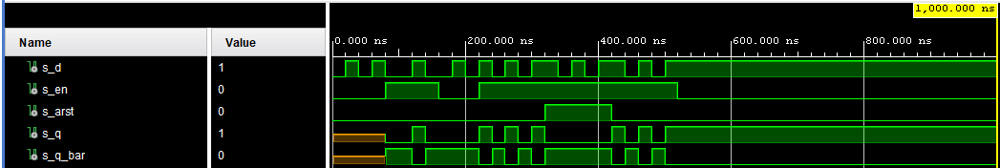
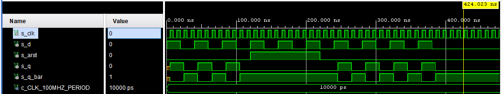
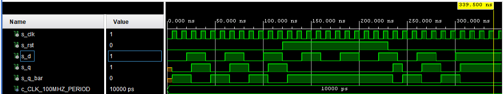
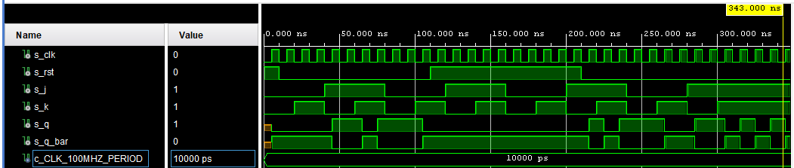
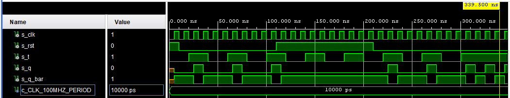
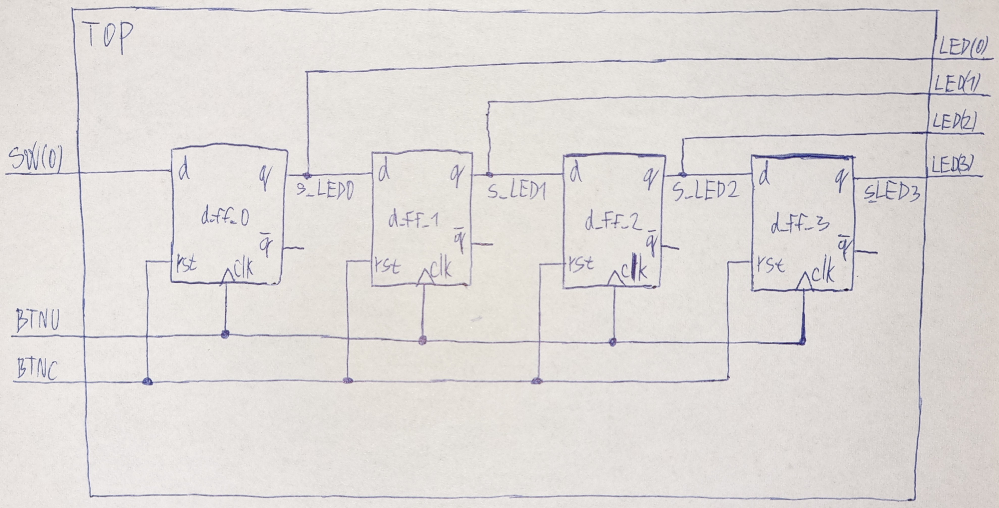
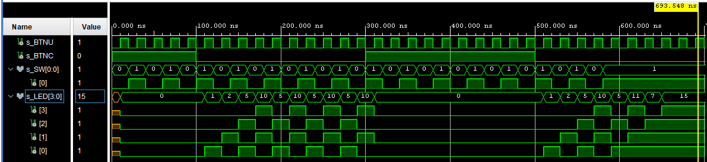

# 07-ffs

1. Preparation tasks


* Characteristic equations and completed tables for D, JK, T flip-flops


   | **D** | **Qn** | **Q(n+1)** | **Comments** |
   | :-: | :-: | :-: | :-- |
   | 0 | 0 | 0 | No change |
   | 0 | 1 | 0 | Reset |
   | 1 | 0 | 1 | Set |
   | 1 | 1 | 1 | No change |

   | **J** | **K** | **Qn** | **Q(n+1)** | **Comments** |
   | :-: | :-: | :-: | :-: | :-- |
   | 0 | 0 | 0 | 0 | No change |
   | 0 | 0 | 1 | 1 | No change |
   | 0 | 1 | 0 | 0 | Reset |
   | 0 | 1 | 1 | 0 | Reset |
   | 1 | 0 | 0 | 1 | Set |
   | 1 | 0 | 1 | 1 | Set |
   | 1 | 1 | 0 | 1 | Toggle |
   | 1 | 1 | 1 | 0 | Toggle |

   | **T** | **Qn** | **Q(n+1)** | **Comments** |
   | :-: | :-: | :-: | :-- |
   | 0 | 0 | 0 | No change |
   | 0 | 1 | 1 | No change |
   | 1 | 0 | 1 | Toggle |
   | 1 | 1 | 0 | Toggle |


2. D latch


* VHDL process `p_d_latch`

```vhdl
    p_d_latch : process(en, d, arst)
    begin
        if (arst = '1') then
            q     <= '0';
            q_bar <= '1';
        elsif (en = '1') then
            q     <= d;
            q_bar <= not d;
        end if;
    end process p_d_latch;
```


* VHDL testbench `tb_d_latch`

```vhdl
    p_stimulus : process
    begin
        report "Stimulus process started" severity note;

        s_en   <= '0'; s_d <= '0'; s_arst <= '0'; wait for 20 ns;
        s_d    <= '1'; wait for 20 ns;
        s_d    <= '0'; wait for 20 ns;
        s_d    <= '1'; wait for 20 ns;
        
        -- Test enable
        s_en   <= '1'; s_d <= '0'; wait for 20 ns;
        s_d    <= '0'; wait for 20 ns;
        s_d    <= '1'; wait for 20 ns;
        s_d    <= '0'; wait for 20 ns;
        s_en   <= '0'; wait for 20 ns;
        s_d    <= '1'; wait for 20 ns;
        s_d    <= '0'; wait for 20 ns;
        
        -- Test async-reset
        s_en   <= '1'; s_d <= '1'; wait for 20 ns;
        s_d    <= '0'; wait for 20 ns;
        s_d    <= '1'; wait for 20 ns;
        s_d    <= '0'; wait for 20 ns;
        s_d    <= '1'; wait for 20 ns;
        s_arst <= '1'; wait for 20 ns;
        s_d    <= '0'; wait for 20 ns;
        s_d    <= '1'; wait for 20 ns;
        s_d    <= '0'; wait for 20 ns;
        s_d    <= '1'; wait for 20 ns;
        s_arst <= '0'; wait for 20 ns;
        s_d    <= '0'; wait for 20 ns;
        s_d    <= '1'; wait for 20 ns;
        s_d    <= '0'; wait for 20 ns;
        s_d    <= '1'; wait for 20 ns;
        s_en   <= '0'; wait for 20 ns;

        report "Stimulus process finished" severity note;
        wait;
    end process p_stimulus;
```


* Screenshot with simulated time waveforms




3. Flip-flops


* VHDL process `p_d_ff_arst`

```vhdl
    p_d_ff_arst : process(clk, arst)
    begin
        if (arst = '1') then
            q     <= '0';
            q_bar <= '1';
        elsif rising_edge(clk) then
            q     <= d;
            q_bar <= not d;
        end if;
    end process p_d_ff_arst;
```


* VHDL testbench `p_d_ff_arst`

```vhdl
    p_clk_gen : process
    begin
        while now < 750 ns loop
            s_clk <= '0';
            wait for c_CLK_100MHZ_PERIOD / 2;
            s_clk <= '1';
            wait for c_CLK_100MHZ_PERIOD / 2;
        end loop;
        wait;
    end process p_clk_gen;

    p_reset_gen : process
    begin
        s_arst <= '0'; wait for 120 ns;
        s_arst <= '1'; wait for 100 ns;
        s_arst <= '0'; wait;
    end process p_reset_gen;

    p_stimulus : process
    begin
        report "Stimulus process started" severity note;

        s_d    <= '1'; wait for 20 ns;
        s_d    <= '0'; wait for 20 ns;
        s_d    <= '1'; wait for 20 ns;
        s_d    <= '0'; wait for 20 ns;
        s_d    <= '1'; wait for 20 ns;
        s_d    <= '0'; wait for 20 ns;
        s_d    <= '1'; wait for 20 ns;
        s_d    <= '0'; wait for 20 ns;
        s_d    <= '1'; wait for 20 ns;
        s_d    <= '0'; wait for 20 ns;
        s_d    <= '1'; wait for 20 ns;
        s_d    <= '0'; wait for 20 ns;
        s_d    <= '1'; wait for 20 ns;
        s_d    <= '0'; wait for 20 ns;
        s_d    <= '1'; wait for 20 ns;
        s_d    <= '0'; wait for 20 ns;
        s_d    <= '1'; wait for 20 ns;
        s_d    <= '0'; wait for 20 ns;
        s_d    <= '1'; wait for 20 ns;
        s_d    <= '0'; wait for 20 ns;

        report "Stimulus process finished" severity note;
        wait;
    end process p_stimulus;
```


* Screenshot with simulated time waveforms `p_d_ff_arst`




* VHDL process `p_d_ff_rst`

```vhdl
    p_d_ff_rst : process(clk)
    begin
        if rising_edge(clk) then
            if (rst = '1') then
                q     <= '0';
                q_bar <= '1';
            else
                q     <= d;
                q_bar <= not d;
            end if;
        end if;
    end process p_d_ff_rst;
```


* VHDL testbench `p_d_ff_rst`

```vhdl
    uut_d_ff_rst : entity work.d_ff_rst
        port map(
            d     => s_d,
            clk   => s_clk,
            rst   => s_rst,
            q     => s_q,
            q_bar => s_q_bar
        );

    p_clk_gen : process
    begin
        while now < 750 ns loop
            s_clk <= '0';
            wait for c_CLK_100MHZ_PERIOD / 2;
            s_clk <= '1';
            wait for c_CLK_100MHZ_PERIOD / 2;
        end loop;
        wait;
    end process p_clk_gen;

    p_reset_gen : process
    begin
        s_rst <= '0'; wait for 120 ns;
        s_rst <= '1'; wait for 110 ns;
        s_rst <= '0'; wait;
    end process p_reset_gen;

    p_stimulus : process
    begin
        report "Stimulus process started" severity note;
        
        s_d <= '0'; wait for 20 ns;
        s_d <= '1'; wait for 20 ns;
        s_d <= '0'; wait for 20 ns;
        s_d <= '1'; wait for 20 ns;
        s_d <= '0'; wait for 20 ns;
        s_d <= '1'; wait for 20 ns;
        s_d <= '0'; wait for 20 ns;
        s_d <= '1'; wait for 20 ns;
        s_d <= '0'; wait for 20 ns;
        s_d <= '1'; wait for 20 ns;
        s_d <= '0'; wait for 20 ns;
        s_d <= '1'; wait for 20 ns;
        s_d <= '0'; wait for 20 ns;
        s_d <= '1'; wait for 20 ns;
        s_d <= '0'; wait for 20 ns;
        s_d <= '1'; wait for 20 ns;

        report "Stimulus process finished" severity note;
        wait;
    end process p_stimulus;
```


* Screenshot with simulated time waveforms `p_d_ff_rst`




* VHDL process `p_jk_ff_rst`

```vhdl
    p_jk_ff_rst : process(clk)
    begin
        if rising_edge(clk) then
            if (rst = '1') then
                s_q     <= '0';
                s_q_bar <= '1';
            else
                if (j = '0' and k = '0') then
                    s_q     <= s_q;
                    s_q_bar <= s_q_bar;
                elsif (j = '0' and k = '1') then
                    s_q     <= '0';
                    s_q_bar <= '1';
                elsif (j = '1' and k = '0') then
                    s_q     <= '1';
                    s_q_bar <= '0';
                else
                    s_q     <= not s_q;
                    s_q_bar <= not s_q_bar;
                end if;
            end if;
        end if;
    end process p_jk_ff_rst;
    q     <= s_q;
    q_bar <= s_q_bar;
```


* VHDL testbench `p_jk_ff_rst`

```vhdl
    p_clk_gen : process
    begin
        while now < 750 ns loop
            s_clk <= '0';
            wait for c_CLK_100MHZ_PERIOD / 2;
            s_clk <= '1';
            wait for c_CLK_100MHZ_PERIOD / 2;
        end loop;
        wait;
    end process p_clk_gen;

    p_reset_gen : process
    begin
        s_rst <= '1'; wait for 10 ns;
        s_rst <= '0'; wait for 100 ns;
        s_rst <= '1'; wait for 100 ns;
        s_rst <= '0'; wait;
    end process p_reset_gen;

    p_stimulus : process
    begin
        report "Stimulus process started" severity note;
        s_j <= '0'; s_k <= '0'; wait for 20 ns;
        s_j <= '0'; s_k <= '1'; wait for 20 ns;
        s_j <= '1'; s_k <= '0'; wait for 20 ns;
        s_j <= '1'; s_k <= '1'; wait for 20 ns;
        s_j <= '0'; s_k <= '0'; wait for 20 ns;
        s_j <= '0'; s_k <= '1'; wait for 20 ns;
        s_j <= '1'; s_k <= '0'; wait for 20 ns;
        s_j <= '1'; s_k <= '1'; wait for 20 ns;
        s_j <= '0'; s_k <= '0'; wait for 20 ns;
        s_j <= '0'; s_k <= '1'; wait for 20 ns;
        s_j <= '1'; s_k <= '0'; wait for 20 ns;
        s_j <= '1'; s_k <= '1'; wait for 20 ns;
        s_j <= '0'; s_k <= '0'; wait for 20 ns;
        s_j <= '0'; s_k <= '1'; wait for 20 ns;
        s_j <= '1'; s_k <= '0'; wait for 20 ns;
        s_j <= '1'; s_k <= '1'; wait for 20 ns;
        report "Stimulus process finished" severity note;
        wait;
    end process p_stimulus;
```


* Screenshot with simulated time waveforms `p_jk_ff_rst`




* VHDL process `p_t_ff_rst`

```vhdl
    signal s_q     : std_logic;
    signal s_q_bar : std_logic;
begin
    p_t_ff_rst : process(clk)
    begin
        if rising_edge(clk) then
            if (rst = '1') then
                s_q     <= '0';
                s_q_bar <= '1';
            elsif (t = '1') then
                s_q     <= not s_q;
                s_q_bar <= s_q;
            end if;
        end if;
    end process p_t_ff_rst;
    q     <= s_q;
    q_bar <= s_q_bar;
```


* VHDL testbench `p_t_ff_rst`

```vhdl
    p_clk_gen : process
    begin
        while now < 750 ns loop
            s_clk <= '0';
            wait for c_CLK_100MHZ_PERIOD / 2;
            s_clk <= '1';
            wait for c_CLK_100MHZ_PERIOD / 2;
        end loop;
        wait;
    end process p_clk_gen;

    p_reset_gen : process
    begin
        s_rst <= '1'; wait for 10 ns;
        s_rst <= '0'; wait for 100 ns;
        s_rst <= '1'; wait for 100 ns;
        s_rst <= '0'; wait;
    end process p_reset_gen;

    p_stimulus : process
    begin
        report "Stimulus process started" severity note;
        
        s_t <= '0'; wait for 20 ns;
        s_t <= '1'; wait for 20 ns;
        s_t <= '0'; wait for 20 ns;
        s_t <= '1'; wait for 20 ns;
        s_t <= '0'; wait for 20 ns;
        s_t <= '1'; wait for 20 ns;
        s_t <= '0'; wait for 20 ns;
        s_t <= '1'; wait for 20 ns;
        s_t <= '0'; wait for 20 ns;
        s_t <= '1'; wait for 20 ns;
        s_t <= '0'; wait for 20 ns;
        s_t <= '1'; wait for 20 ns;
        s_t <= '0'; wait for 20 ns;
        s_t <= '1'; wait for 20 ns;
        s_t <= '0'; wait for 20 ns;
        s_t <= '1'; wait for 20 ns;
        
        report "Stimulus process finished" severity note;
        wait;
    end process p_stimulus;
```


* Screenshot with simulated time waveforms `p_t_ff_rst`




4. Shift register


* Image of the shift register schematic




* Design `top.vhd`

```vhdl
library IEEE;
use IEEE.STD_LOGIC_1164.ALL;

entity top is
    Port (
        BTNU      : in  STD_LOGIC;
        BTNC      : in  STD_LOGIC;
        SW        : in  STD_LOGIC_VECTOR (1 - 1 downto 0);
        LED       : out STD_LOGIC_VECTOR (4 - 1 downto 0)
         );
end top;

------------------------------------------------------------------------
-- Architecture body for top level
------------------------------------------------------------------------
architecture Behavioral of top is

    -- Internal signals between flip-flops
    -- WRITE YOUR CODE HERE
    signal s_LED0 : std_logic;
    signal s_LED1 : std_logic;
    signal s_LED2 : std_logic;
    signal s_LED3 : std_logic;

begin

    --------------------------------------------------------------------
    -- Four instances (copies) of D type FF entity
    d_ff_0 : entity work.d_ff_rst
        port map(
            clk   => BTNU,
            rst   => BTNC,
            -- WRITE YOUR CODE HERE
            d => SW(0),
            q => s_LED0
            );

    d_ff_1 : entity work.d_ff_rst
        port map(
            clk   => BTNU,
            rst   => BTNC,
            -- WRITE YOUR CODE HERE
            d => s_LED0,
            q => s_LED1
            );

    -- WRITE YOUR CODE HERE
    d_ff_2 : entity work.d_ff_rst
        port map(
            clk   => BTNU,
            rst   => BTNC,
            -- WRITE YOUR CODE HERE
            d => s_LED1,
            q => s_LED2
            );

    d_ff_3 : entity work.d_ff_rst
        port map(
            clk   => BTNU,
            rst   => BTNC,
            -- WRITE YOUR CODE HERE
            d => s_LED2,
            q => s_LED3
            );

    LED(0) <= s_LED0;
    LED(1) <= s_LED1;
    LED(2) <= s_LED2;
    LED(3) <= s_LED3;

end architecture Behavioral;
```


* Tesbench `tb_top.vhd`

```vhdl

library IEEE;
use IEEE.STD_LOGIC_1164.ALL;

entity tp_top is
end tp_top;

architecture Behavioral of tp_top is

    signal s_SW      : std_logic_vector(1 - 1 downto 0);
    signal s_BTNU    : std_logic;
    signal s_BTNC    : std_logic;
    signal s_LED     : std_logic_vector(4 - 1 downto 0);
    
begin

    uut_top : entity work.top
        port map(
            SW(0)  => s_SW(0),
            BTNU   => s_BTNU,
            BTNC   => s_BTNC,
            LED(0) => s_LED(0),
            LED(1) => s_LED(1),
            LED(2) => s_LED(2),
            LED(3) => s_LED(3)
        );
        
    p_clk_gen : process
    begin
        while now < 750 ns loop
            s_BTNU <= '0'; wait for 10 ns;
            s_BTNU <= '1'; wait for 10 ns;
        end loop;
        wait;
    end process p_clk_gen;

    p_reset_gen : process
    begin
        s_BTNC <= '1'; wait for 100 ns;
        s_BTNC <= '0'; wait for 200 ns;
        s_BTNC <= '1'; wait for 200 ns;
        s_BTNC <= '0'; wait;
    end process p_reset_gen;

    p_stimulus : process
    begin
        report "Stimulus process started" severity note;
        
        s_SW(0) <= '0'; wait for 20 ns;
        s_SW(0) <= '1'; wait for 20 ns;
        s_SW(0) <= '0'; wait for 20 ns;
        s_SW(0) <= '1'; wait for 20 ns;
        s_SW(0) <= '0'; wait for 20 ns;
        s_SW(0) <= '1'; wait for 20 ns;
        s_SW(0) <= '0'; wait for 20 ns;
        s_SW(0) <= '1'; wait for 20 ns;
        s_SW(0) <= '0'; wait for 20 ns;
        s_SW(0) <= '1'; wait for 20 ns;
        s_SW(0) <= '0'; wait for 20 ns;
        s_SW(0) <= '1'; wait for 20 ns;
        s_SW(0) <= '0'; wait for 20 ns;
        s_SW(0) <= '1'; wait for 20 ns;
        s_SW(0) <= '0'; wait for 20 ns;
        s_SW(0) <= '1'; wait for 20 ns;
        s_SW(0) <= '0'; wait for 20 ns;
        s_SW(0) <= '1'; wait for 20 ns;
        s_SW(0) <= '0'; wait for 20 ns;
        s_SW(0) <= '1'; wait for 20 ns;
        s_SW(0) <= '0'; wait for 20 ns;
        s_SW(0) <= '1'; wait for 20 ns;
        s_SW(0) <= '0'; wait for 20 ns;
        s_SW(0) <= '1'; wait for 20 ns;
        s_SW(0) <= '0'; wait for 20 ns;
        s_SW(0) <= '1'; wait for 20 ns;
        s_SW(0) <= '0'; wait for 20 ns;
        s_SW(0) <= '1'; wait for 20 ns;
        s_SW(0) <= '0'; wait for 20 ns;
        s_SW(0) <= '1'; wait for 20 ns;

        report "Stimulus process finished" severity note;
        wait;
    end process p_stimulus;
end Behavioral;
```


* Screenshot with simulated time waveforms `tb_top.vhd`




* Constraints `nexys-a7-50t.xdc`
```vhdl
##Switches
set_property -dict { PACKAGE_PIN J15   IOSTANDARD LVCMOS33 } [get_ports { SW[0] }]; #IO_L24N_T3_RS0_15 Sch=sw[0]
## LEDs

set_property -dict { PACKAGE_PIN H17   IOSTANDARD LVCMOS33 } [get_ports { LED[0] }]; #IO_L18P_T2_A24_15 Sch=led[0]
set_property -dict { PACKAGE_PIN K15   IOSTANDARD LVCMOS33 } [get_ports { LED[1] }]; #IO_L24P_T3_RS1_15 Sch=led[1]
set_property -dict { PACKAGE_PIN J13   IOSTANDARD LVCMOS33 } [get_ports { LED[2] }]; #IO_L17N_T2_A25_15 Sch=led[2]
set_property -dict { PACKAGE_PIN N14   IOSTANDARD LVCMOS33 } [get_ports { LED[3] }]; #IO_L8P_T1_D11_14 Sch=led[3]

##Buttons
set_property -dict { PACKAGE_PIN N17   IOSTANDARD LVCMOS33 } [get_ports { BTNC }]; #IO_L9P_T1_DQS_14 Sch=btnc
set_property -dict { PACKAGE_PIN M18   IOSTANDARD LVCMOS33 } [get_ports { BTNU }]; #IO_L4N_T0_D05_14 Sch=btnu
```
