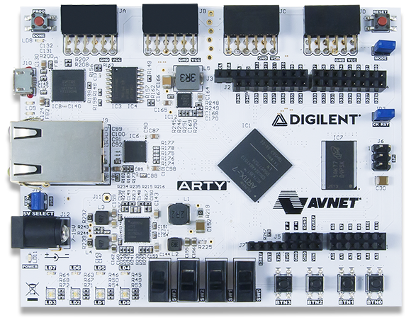
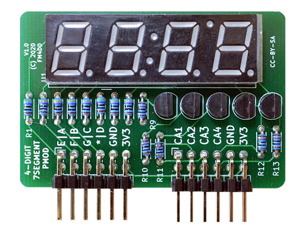
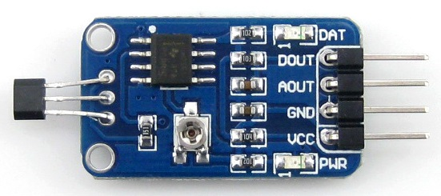

# Konzola pre rotoped/bicykel, hallova sonda, meranie a zobrazenie rýchlosti a prejdenej vzdialenosti

### Členovia týmu

Adam Budáč, Petr Dočkalík, Ladislav Drápal, Ondřej Dudášek

* [Link na GitHub adresár s projektom](https://github.com/NechTaSilaSprevadza/Digital-electronics-1/tree/main/Labs/09-project)

### Ciele projektu

Tvorba cyklocomputeru, ktorý meria a zobrazuje rýchlosť a prejdenú vzdialenosť pomocou hallovej sondy.

## Popis hardwaru

1. Použitý hardware

* [Arty Artix-7](https://store.digilentinc.com/arty-a7-artix-7-fpga-development-board/) - Vývojová doska Arty A7, možnosť použiť čipy A7-35T alebo A7-100T. Tlačidlami BNT0 je vykonaný synchrónny reset cyklocomputera, tlačidlom BTN1 je nastavené zobrazenie aktuálnej rýchlosti a tlačidlom BTN2 je nastavenie prejdenej vzdialenosti.



* [Pmod 4x7seg](http://fpga.fm4dd.com/?pmod/7seg4) - 4-digit 7-segmentovka so spoločnou anódou. Segmentovka je zapojená na vysokorýchlostných Pmod JB a Pmod JC konektoroch bez ochranných rezistorov. Doska 7-segmentovky obsahuje vlastné ochranné rezistory. Multiplexovanie jednotlivých segmentoviek je každých 4 ms, čo pri 4 segmentovkách robí snímkovú frekvenciu 60 FPS a zabraňuje to blikaniu. Rýchlosť je zobrazená v km/h s maximálnou rýchlosťou 999,9 km/h a prejdená vzdialenosť v km s maximálnym nájazdom 999,9 km.



* [Pmod Hallova sonda](https://www.amazon.com/Sensor-Linear-Effect-Sensitivity-Detection/dp/B00W029QYC) - Hallova sonda 49E s komparátorom LM393. Obsahuje analógový a digitálny výstup. Má nastaviteľnú prahovú hodnotu komparačného napätia. Doska sondy je zapojená na štandardných Pmod JD konektoroch s ochrannými rezistormi, ktoré sa hodia ako ochrana pri použití na priame prepojenie s analógovým výstupom sondy (AOUT) alebo digitálnym výstupom komparátora (DOUT).



2. Zapojenie

* Funkcie tlačidiel

| **Tlačidlo** | **Funkcia** |
| :-: | :-: |
| BTN0 | Reset |
| BTN1 | Zobrazenie aktuálnej rýchlosti |
| BTN2 | Zobrazenie prejdenej vzdialenosti |

* Zapojenie 7-segmentovy

| **Konektor** | **Pin** | **Názov pinu** | **Funkcia pinu** |
| :-: | :-: | :-: | :-: |
| Pmod JB | 1 | E15 | segment A |
| Pmod JB | 2 | E16 | segment B |
| Pmod JB | 3 | D15 | segment C |
| Pmod JB | 4 | C15 | segment D |
| Pmod JB | 5 | GND | GND |
| Pmod JB | 6 | VCC | 3V3 |
| Pmod JB | 7 | J17 | segment E |
| Pmod JB | 8 | J18 | segment F |
| Pmod JB | 9 | K15 | segment G |
| Pmod JB | 10 | J15 | segment DP |
| Pmod JB | 11 | GND | GND |
| Pmod JB | 12 | VCC | 3V3 |
| Pmod JC | 1 | U12 | anóda digit 1 |
| Pmod JC | 2 | V12 | anóda digit 2 |
| Pmod JC | 3 | V10 | anóda digit 3 |
| Pmod JC | 4 | V11 | anóda digit 4 |
| Pmod JC | 5 | GND | GND |
| Pmod JC | 6 | VCC | 3V3 |
| Pmod JC | 10 | U13 | anóda dvojbodka |
| Pmod JC | 11 | GND | GND |
| Pmod JC | 12 | VCC | 3V3 |

* Zapojenie Hallovej sondy

| **Konektor** | **Pin** | **Názov pinu** | **Funkcia pinu** |
| :-: | :-: | :-: | :-: |
| Pmod JD | 3 | F4 | DOUT |
| Pmod JD | 4 | F3 | AOUT |
| Pmod JD | 5 | GND | GND |
| Pmod JD | 6 | VCC | 3V3 |


## Popis a simulácie VHDL modulov

```vhdl

```

## Popis a simulácia TOP modulu

```vhdl

```

## Video

[Video](https: google drive)

## Referencie

   1. 
   2. 
   3. 
   4. 

