# Konzola pre rotoped/bicykel, hallova sonda, meranie a zobrazenie rýchlosti a prejdenej vzdialenosti

### Členovia týmu

Adam Budáč, Petr Dočkalík, Ladislav Drápal, Ondřej Dudášek

* [Link na GitHub adresár s projektom](https://github.com/NechTaSilaSprevadza/Digital-electronics-1/tree/main/Labs/09-project)

### Ciele projektu

Tvorba cyklocomputeru, ktorý meria a zobrazuje rýchlosť a prejdenú vzdialenosť pomocou hallovej sondy.

## Popis hardwaru

1. Použitý hardware

[Arty Artix-7](https://store.digilentinc.com/arty-a7-artix-7-fpga-development-board/) - Vývojová doska Arty A7, možnosť použiť čipy A7-35T alebo A7-100T. Tlačidlom BNT0 je vykonaný synchrónny reset cyklocomputera, prepínačom SW0 sa prepína medzi zobrazením aktuálnej rýchlosti a celkovej prejdenej vzdialenosti.


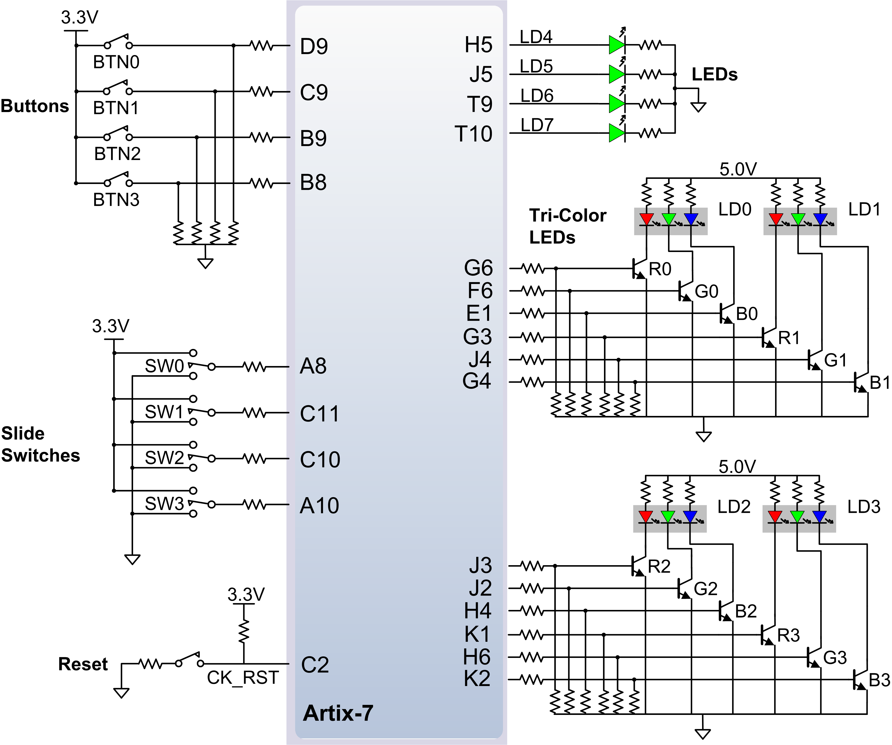


[Pmod 4x7seg](http://fpga.fm4dd.com/?pmod/7seg4) - 4-digit 7-segmentovka so spoločnou anódou. Segmentovka je zapojená na vysokorýchlostných Pmod JB a Pmod JC konektoroch bez ochranných rezistorov. Doska 7-segmentovky obsahuje vlastné ochranné rezistory. Multiplexovanie jednotlivých segmentoviek je každých 4 ms, čo pri 4 segmentovkách robí snímkovú frekvenciu 60 FPS a zabraňuje to blikaniu. Rýchlosť je zobrazená v km/h s maximálnou rýchlosťou 999,9 km/h a prejdená vzdialenosť v km s maximálnym nájazdom 999,9 km.


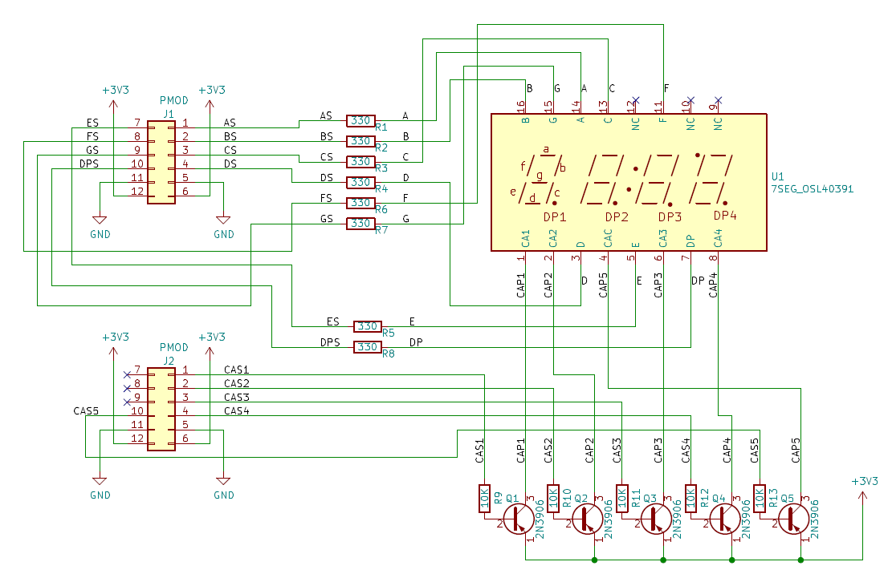

[Pmod Hallova sonda](https://www.amazon.com/Sensor-Linear-Effect-Sensitivity-Detection/dp/B00W029QYC) - Hallova sonda 49E s komparátorom LM393. Obsahuje analógový a digitálny výstup. Má nastaviteľnú prahovú hodnotu komparačného napätia. Doska sondy je zapojená na štandardných Pmod JD konektoroch s ochrannými rezistormi, ktoré sa hodia ako ochrana pri použití na priame prepojenie s analógovým výstupom sondy (AOUT) alebo digitálnym výstupom komparátora (DOUT). Využitý je len DOUT ako indikácia otáčania kolesa bicykla.


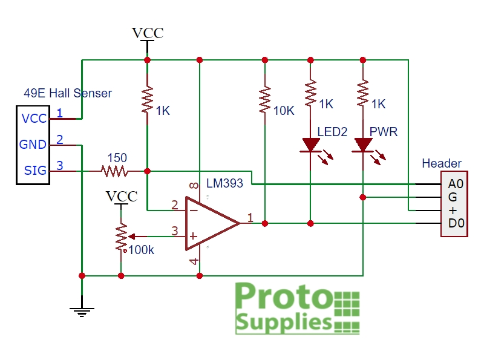

2. Zapojenie

Funkcie tlačidiel

   | **Vstup** | **Funkcia** |
   | :-: | :-: |
   | BTN0 | Reset |
   | BTN1 | Prepínanie zobrazenia aktuálnej rýchlosti a celkovej prejdenej vzdialenosti |

Indikátory

   | **Stav** | **indikátor** |
   | :-: | :-: |
   | nastavení obvodu kola | LED0 R |
   | ujetá vzdálenost | LED0 G |
   | rychlost | LED0 B |


Zapojenie 7-segmentovky

   | **Konektor** | **Pin** | **Názov pinu** | **Funkcia pinu** |
   | :-: | :-: | :-: | :-: |
   | Pmod JB | 1 | E15 | segment A |
   | Pmod JB | 2 | E16 | segment B |
   | Pmod JB | 3 | D15 | segment C |
   | Pmod JB | 4 | C15 | segment D |
   | Pmod JB | 5 | GND | GND |
   | Pmod JB | 6 | VCC | 3V3 |
   | Pmod JB | 7 | J17 | segment E |
   | Pmod JB | 8 | J18 | segment F |
   | Pmod JB | 9 | K15 | segment G |
   | Pmod JB | 10 | J15 | segment DP |
   | Pmod JB | 11 | GND | GND |
   | Pmod JB | 12 | VCC | 3V3 |
   | Pmod JC | 1 | U12 | anóda digit 1 |
   | Pmod JC | 2 | V12 | anóda digit 2 |
   | Pmod JC | 3 | V10 | anóda digit 3 |
   | Pmod JC | 4 | V11 | anóda digit 4 |
   | Pmod JC | 5 | GND | GND |
   | Pmod JC | 6 | VCC | 3V3 |
   | Pmod JC | 10 | U13 | anóda dvojbodka |
   | Pmod JC | 11 | GND | GND |
   | Pmod JC | 12 | VCC | 3V3 |

Zapojenie Hallovej sondy

   | **Konektor** | **Pin** | **Názov pinu** | **Funkcia pinu** |
   | :-: | :-: | :-: | :-: |
   | Pmod JD | 3 | F4 | DOUT |
   | Pmod JD | 4 | F3 | AOUT |
   | Pmod JD | 5 | GND | GND |
   | Pmod JD | 6 | VCC | 3V3 |


## Popis a simulácie VHDL modulov


### clock_enable_1

Modul [clock_enable_1](VHDL/Designs/clock_enable_1.vhd) je použitý ako generátor pulzov, ktoré slúžia na výpočet aktuálnej rýchlosti. Pulzy sa generujú každú milisekundu.

```vhdl
library ieee;               
use ieee.std_logic_1164.all;
use ieee.numeric_std.all;   

------------------------------------------------------------------------
-- Entity declaration for clock enable
------------------------------------------------------------------------
entity clock_enable_1 is
    generic(
        g_MAX : natural := 100000    -- Number of clk pulses to generate                                
    );  
        
    port(
        clk   : in  std_logic;      
        reset : in  std_logic;      
        ce_1  : out std_logic      
    );
end entity clock_enable_1;

------------------------------------------------------------------------
-- Architecture body for clock enable
------------------------------------------------------------------------
architecture Behavioral of clock_enable_1 is

    signal s_cnt_local : natural; -- Local counter
    
begin
    p_clk_ena : process(clk)
    begin
        if rising_edge(clk) then       

            if (reset = '1') then       
                s_cnt_local <= 0;      
                ce_1        <= '0';    
                 
            -- Test number of clock periods        
            elsif (s_cnt_local >= (g_MAX - 1)) then   
                s_cnt_local <= 0;       
                ce_1        <= '1';     

            else
                s_cnt_local <= s_cnt_local + 1;
                ce_1        <= '0';
            end if;
        end if;
    end process p_clk_ena;

end architecture Behavioral;
```

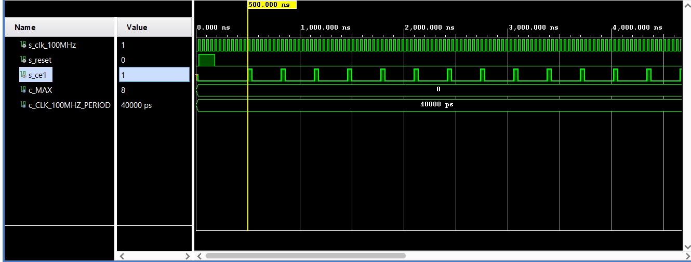


### cnt_distance

Modul [cnt_distance](VHDL/Designs/cnt_distance.vhd) je jednoduchý čítač, který jsme používali v laboratorních úlohách. V našem projektu Console for bike používáme jako hodiny příchozí impulzy z Hallovy sondy, umístěné blízko kola. Vlivem neustálé změny rychlosti točení se taktéž mění délka mezi jednotlivými impulzy a proto nebylo dobré řídit se hodinami, ale řídil jsem se resetem, aby se mi nemohlo stát, že reset skončí v sestupné hraně hodinového impulzu, kde by nevynuloval proměnnou čítače.

První okno simulace simuluje rychlou jízdu a čítání impulzů z Hallovy sondy.

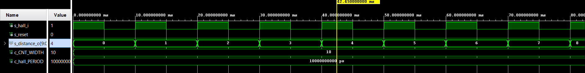

Druhé okno simulace simuluje zpomalení a příchozí reset z nadřazené logiky, který vynulovává čítač.

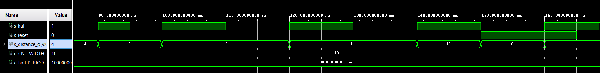

Ještě větší zpomalení.

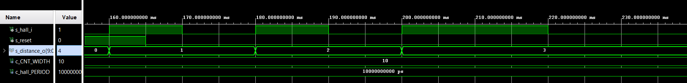

Příchozí druhý reset.

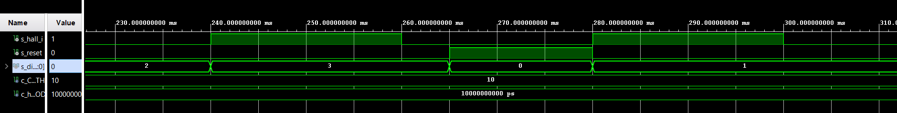

Zrychlení jízdy.

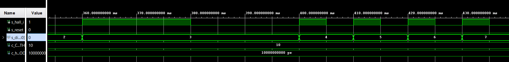

```vhdl
library ieee;
use ieee.std_logic_1164.all;
use ieee.numeric_std.all;

------------------------------------------------------------------------
-- Entity declaration for n-bit counter
------------------------------------------------------------------------
entity cnt_distance is
    generic(
        g_CNT_WIDTH : natural := 4      -- Number of bits for counter
    );
    port(
        hall_i      : in  std_logic;       -- Hall sond impuls
        reset       : in  std_logic;          -- Synchronous reset
        distance_o  : out std_logic_vector(g_CNT_WIDTH - 1 downto 0)
    );
end entity cnt_distance;

------------------------------------------------------------------------
-- Architecture body for n-bit counter
------------------------------------------------------------------------
architecture behavioral of cnt_distance is

    -- Local counter
    signal s_cnt_local : unsigned(g_CNT_WIDTH - 1 downto 0) := (others => '0');

begin
    --------------------------------------------------------------------
    -- p_cnt_distance:
    -- process with synchronous reset which implements n-bit 
    --------------------------------------------------------------------
    p_cnt_distance : process(hall_i,reset)
    begin
        if (reset = '0') then                       -- Reset s_cnt_local and distance_o too
            if rising_edge(hall_i) then
                s_cnt_local <= s_cnt_local + 1;     --Logic one in cnt_distance
            end if;
        else 
            s_cnt_local <= (others => '0');         -- Clear all bits     
            
        end if;
    end process p_cnt_distance;

    -- Output must be retyped from "unsigned" to "std_logic_vector"
    distance_o <= std_logic_vector(s_cnt_local);

end architecture behavioral;
```


### counter_speed

Hallova sonda je v kódu demonstrována jako hodiny, tj. počet opakujících se period. Modul [counter_speed](VHDL/Designs/counter_speed.vhd) je čítač, který čítá impulzy z Hallové sondy. Výstup čítače je závislý na hodinách. Hodiny znázorňují otáčku kola za 1 sekundu. Náběžnou hranou z hodin nulujeme čítač. Funkcí reset jsme schopni nulovat čítač i výstup z čítače. 

```vhdl
library IEEE;
use IEEE.STD_LOGIC_1164.ALL;
use IEEE.NUMERIC_STD.ALL;
 
-- Uncomment the following library declaration if using
-- arithmetic functions with Signed or Unsigned values
--use IEEE.NUMERIC_STD.ALL;

-- Uncomment the following library declaration if instantiating
-- any Xilinx leaf cells in this code.
--library UNISIM;
--use UNISIM.VComponents.all;

------------------------------------------------------------------------
-- Entity declaration for n-bit counter
------------------------------------------------------------------------
entity counter_speed is
generic(
        g_CNT_WIDTH : natural := 10       -- Number of bits for counter
    );
port(
        clk      : in std_logic;          -- Main clock
        reset    : in std_logic;          -- Synchronous reset
        en_i     : in std_logic;          -- Enable input   
        hall_i   : in std_logic;          -- Direction of the counter
        spd_o    : out std_logic_vector(g_CNT_WIDTH - 1 downto 0);
        cnt_o    : out std_logic_vector(g_CNT_WIDTH - 1 downto 0)
    );
end counter_speed;

------------------------------------------------------------------------
-- Architecture body for n-bit counter
------------------------------------------------------------------------ 
architecture Behavioral of counter_speed is

    -- Local counter 
    signal s_spd_local : unsigned(g_CNT_WIDTH - 1 downto 0);
    signal s_cnt : unsigned(g_CNT_WIDTH - 1 downto 0);

begin
    --------------------------------------------------------------------
    -- p_counter_speed:
    -- Clocked process with synchronous reset which implements n-bit 
    -- up/down counter and out of counter.
    --------------------------------------------------------------------
    p_counter_speed : process(clk,hall_i,reset)
    begin
       if rising_edge(hall_i) then
          if (en_i = '1') then                    -- counting enabled
             if (s_cnt >= 2**g_CNT_WIDTH - 1) then
                s_cnt <= (others => '1');
             else
                s_cnt <= s_cnt + 1;
             end if;
          end if;
       end if;  
 
       if rising_edge(clk) then
          s_spd_local <= s_cnt;
          s_cnt <= (others => '0');
       end if;
 
       if (reset = '1') then            -- clear counters and output on reset
          s_spd_local <= (others => '0');
          s_cnt <= (others => '0');
       end if;

       if (en_i = '0') then             -- zero speed output if disabled
          s_spd_local <= (others => '0');
       end if;
      
    end process p_counter_speed;
 
    spd_o <= std_logic_vector(s_spd_local);
    cnt_o <= std_logic_vector(s_cnt);
end Behavioral;
```


### in_filter

Modul [in_filter](VHDL/Designs/in_filter.vhd) jsme zkonstruovali kvuli známým problémům ohledně různých elektronických obvodů jako komparátory, relé, součástek jako tlačítka, přepínače, tzv. všude, kde se jedná o změnu logické úrovně, rychlé propojení vodivé cesty, kde se rychle přehoupneme z nízké napěťové úrovně do vysoké a zrovna tu se vytvoří svazek pár zakmitaných impulzů, s kterým si žádná logika sama neporadí, protože ta vnímá pouze čistý impulz do vysoké úrovně určité délky. Integrační synchronní filtr, který podle vstupujících vzorků zvyšuje nebo zmenšuje hodnotu, kterou potom testuje a když je nulová, nebo maximální, tak změní hodnotu na výstupu. U nás konrétně u projektu Console for bike ho používáme u jednoho jediného tlačítka, které nám mění informace zobrazující na displeji a například nastavení hodnoty obvodu kola, kde záleží na tom jak tlačítko zareaguje.

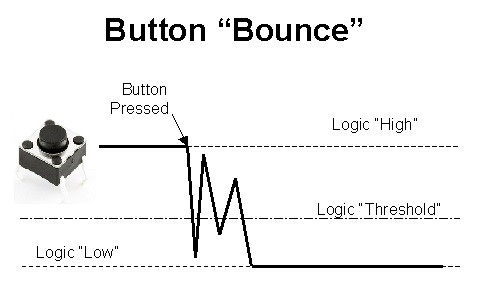

```vhdl
library IEEE;
use IEEE.STD_LOGIC_1164.ALL;
use IEEE.NUMERIC_STD.ALL;

entity int_filter  is
    Generic (
        g_INT_SIZE  : natural := 4  -- internal buffer size in bits
    );
    Port (
        input       : in  std_logic;    -- input to filter
        clk         : in  std_logic;    -- clock for sampling
        output      : out std_logic     -- output
    );
end in_filter;

architecture Behavioral of in_filter is
    signal s_input_sum  : unsigned(g_INT_SIZE - 1 downto 0);
begin
    p_in_filter : process(clk_in)
    begin
    if rising_edge(clk_in) then
        if (input = '1') then 
            if (s_input_sum >= 2**g_INT_SIZE - 2) then
                output <= '1';
                s_input_sum <= (others => '1');
            else
                s_input_sum <= s_input_sum + 1;
            end if;
        else
            if ( s_input_sum <= 1) then
                output <= '0';
                s_input_sum <= (others => '0');
            else
                s_input_sum <= s_input_sum - 1;
            end if;
        end if;
    end if;
    end process p_in_filter;
end Behavioral;
```

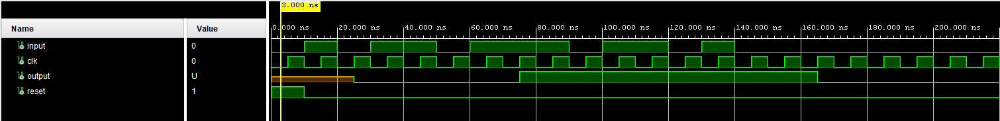


### control

Modul [control](VHDL/Designs/control.vhd) má fungovať ako logika, ktorá prepočítava hodnoty z čítačov na čísla, ktoré sa zobrazujú na displeji..

#### přepínání mezi režimy
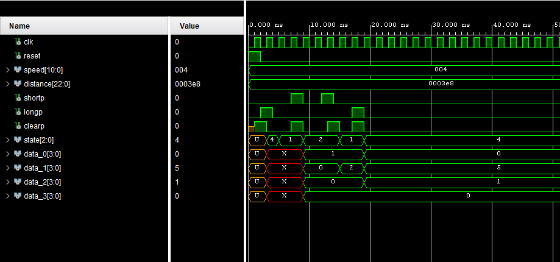
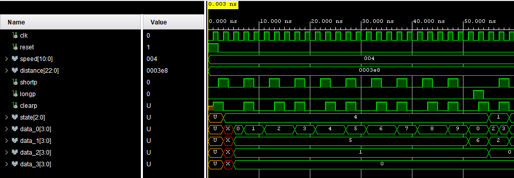

```vhdl

--- control ---
-- author: Petr Dockalik, Ondrej Dudasek, 

--- Description:
-- Controller process for bicycle computer. 
-- switches between three screens: speed, distance and set.
-- Calculates speed and distance from inputs and internal signal s_circumference
-- changeable via set screen. Turns off screen when no activity is detected in 60 seconds.
-- Works with 1

library IEEE;
use IEEE.numeric_std.all;
use IEEE.std_logic_1164.all;

entity control is
    Port (
        -- clock inputs (delete additional later)
        clk       : in std_logic;
        -- inputs
        reset_i     : in std_logic;
        speed_i     : in std_logic_vector(10 - 1 downto 0);
        distance_i  : in std_logic_vector(23 - 1 downto 0);
        
        -- press_detect interface
        short_press_i   : in std_logic;
        long_press_i    : in std_logic;
        clear_press_o   : out std_logic;
        
        -- outputs
        state_o     : out std_logic_vector(3 - 1 downto 0);
        data_o_0    : out std_logic_vector(3 downto 0); -- display outputs
        data_o_1    : out std_logic_vector(3 downto 0);
        data_o_2    : out std_logic_vector(3 downto 0);
        data_o_3    : out std_logic_vector(3 downto 0)
        
    );
end control;

architecture Behavioral of control is
    --- fsm variables
    type t_state is (SET, DST, SPD);
    
    signal s_state      : t_state;
    
    -- clear press detect signals
    signal s_clear         : std_logic;
    signal s_clear_wipe2   : std_logic;
    
    --- computational signals
    -- 9 multiplied by 9 bits is 18, without 6 is 12
    signal s_speed_cms      : std_logic_vector(20 - 1 downto 0);
    signal s_speed_mh       : std_logic_vector(25 - 1 downto 0);
    signal s_speed_kmh      : std_logic_vector(25 - 1 downto 0);
    -- 18 * 9 = 27
    signal s_distance_cm    : std_logic_vector(30 - 1 downto 0);
    signal s_distance_km    : std_logic_vector(30 - 1 downto 0);
    
    
    
    signal s_data_o_0               : std_logic_vector(3 downto 0);
    signal s_data_o_1               : std_logic_vector(3 downto 0);
    signal s_data_o_2               : std_logic_vector(3 downto 0);
    signal s_data_o_3               : std_logic_vector(3 downto 0);
    
    signal s_speed_o_0               : std_logic_vector(3 downto 0);
    signal s_speed_o_1               : std_logic_vector(3 downto 0);
    signal s_speed_o_2               : std_logic_vector(3 downto 0);
    signal s_speed_o_3               : std_logic_vector(3 downto 0);
    
    signal s_set_o_0               : std_logic_vector(3 downto 0);
    signal s_set_o_1               : std_logic_vector(3 downto 0);
    signal s_set_o_2               : std_logic_vector(3 downto 0);
    signal s_set_o_3               : std_logic_vector(3 downto 0);
    
    signal s_dist_o_0               : std_logic_vector(3 downto 0);
    signal s_dist_o_1               : std_logic_vector(3 downto 0);
    signal s_dist_o_2               : std_logic_vector(3 downto 0);
    signal s_dist_o_3               : std_logic_vector(3 downto 0);
    
    signal s_WHEEL_CIRCUMFERENCE    : unsigned(9 - 1 downto 0);

    -- constants 
    constant c_TIMER_WIDTH          : natural := 8;

begin
    
    -- conversion processes
    -- multiply wheel impulses with wheel circumference
    dist_circumference_multiply : entity work.multiply
    generic map(
        g_WIDTH => 30
    ) 
    port map (
        input_1(23 - 1 downto 0)    => distance_i,
        input_1(30 - 1 downto 23)   => (others => '0'), 
        input_2(9 - 1  downto 0)    => std_logic_vector(s_WHEEL_CIRCUMFERENCE),
        input_2(30 - 1 downto 9)    => (others => '0'),
        clk                         => clk,
        output                      => s_distance_cm
    );
    
    -- convert distance from cm to km
    dist_km_divide  : entity work.divide
    generic map(
        g_WIDTH => 30
    ) 
    port map (
        input_1     => s_distance_cm,
        input_2     => std_logic_vector(TO_UNSIGNED(100000, 30)),
        clk         => clk,
        output      => s_distance_km
    );
    
    dist_to_bcd : entity work.decimal_to_bcd
    port map(
        input       => s_distance_km(14 - 1 downto 0),
        clk         => clk,
        output_0    => s_dist_o_0,
        output_1    => s_dist_o_1,
        output_2    => s_dist_o_2,
        output_3    => s_dist_o_3
    );
    
    
    --- speed
    speed_circumference_multiply : entity work.multiply
    generic map(
        g_WIDTH => 20
    ) 
    port map (
        input_1(10 - 1 downto 0)    => speed_i,
        input_1(20 - 1 downto 10)   => (others => '0'), 
        input_2(9  - 1 downto 0)    => std_logic_vector(s_WHEEL_CIRCUMFERENCE),
        input_2(20 - 1 downto 9)    => (others => '0'),
        clk                         => clk,
        output                      => s_speed_cms
    );
    
    speed_hour_multiply : entity work.multiply
    generic map(
        g_WIDTH => 25
    ) 
    port map (
        input_1(20 - 1 downto 0)    => s_speed_cms,
        input_1(25 - 1 downto 20)   => (others => '0'), 
        input_2(25 - 1 downto 0)    => std_logic_vector(TO_UNSIGNED(36, 25)),
        clk                         => clk,
        output                      => s_speed_mh
    );
    
    speed_1000_divide : entity work.divide
    generic map(
        g_WIDTH => 25
    )
    port map(
        input_1      => s_speed_mh,
        input_2      => std_logic_vector(TO_UNSIGNED(1000, 25)),
        clk          => clk,
        output       => s_speed_kmh
    );
    
    speed_to_bcd : entity work.decimal_to_bcd
    port map(
        input       => s_speed_kmh(14 - 1 downto 0),
        clk         => clk,
        output_0    => s_speed_o_0,
        output_1    => s_speed_o_1,
        output_2    => s_speed_o_2,
        output_3    => s_speed_o_3
    );
    
    circumference_to_bcd : entity work.decimal_to_bcd
    port map(
        input(9 - 1 downto 0)   => std_logic_vector(s_WHEEL_CIRCUMFERENCE),
        input(14 - 1 downto 9)  => (others => '0'),
        clk                     => clk,
        output_0                => s_set_o_0,
        output_1                => s_set_o_1,
        output_2                => s_set_o_2,
        output_3                => s_set_o_3
    );
    
    
    --- Finite state machine
    p_control_fsm : process(clk)
    begin
        if rising_edge(clk) then
            if (reset_i = '1') then -- reset
                s_state <= SET;
                s_clear <= '1';
                s_clear_wipe2 <= '0';
                s_WHEEL_CIRCUMFERENCE <= TO_UNSIGNED(150, 9);

            -- wheel circumference set
            elsif s_state = SET then    
                if (long_press_i = '1') then
                    s_clear <= '1';
                    s_state <= SPD;
                elsif (short_press_i = '1') then
                    s_clear <= '1';
                    if (s_WHEEL_CIRCUMFERENCE = TO_UNSIGNED(400, 9)) then
                        s_WHEEL_CIRCUMFERENCE <= TO_UNSIGNED(150, 9);
                    else
                        s_WHEEL_CIRCUMFERENCE <= s_WHEEL_CIRCUMFERENCE + 1;
                    end if;
                end if;

        
            -- show distance
            elsif s_state = DST then
                if (long_press_i = '1') then
                    s_clear <= '1';
                    s_state <= SET;
                elsif (short_press_i = '1') then
                    s_clear <= '1';
                    s_state <= SPD;
                end if;
            
            
            -- show speed
            elsif s_state = SPD then        -- show speed
                if (long_press_i = '1') then
                    s_clear <= '1';
                    s_state <= SET;
                elsif (short_press_i = '1') then
                    s_clear <= '1';
                    s_state <= DST;
                end if;
            
            else    -- unknown state
                s_state <= SET;
            end if;
            
            -- clear bit wipe in next clock
            if (s_clear = '1') then
                s_clear <= '0';
--                if (s_clear_wipe2 = '1') then
--                    clear_press_o <= '0';
--                    s_clear <= '0';
--                    s_clear_wipe2 <= '0';
--                else
--                    s_clear_wipe2 <= '1';
--                end if;
            end if;
        end if;
    end process;
    
    
    p_output : process(clk)
    begin
        if rising_edge(clk) and (reset_i = '0') then
            if (s_state = SET) then -- set circumference mode
                state_o <= "100";
                s_data_o_3 <= s_set_o_3;
                s_data_o_2 <= s_set_o_2;
                s_data_o_1 <= s_set_o_1;
                s_data_o_0 <= s_set_o_0;
    
            elsif (s_state = DST) then 
                state_o <= "010";
                s_data_o_3 <= s_dist_o_3;
                s_data_o_2 <= s_dist_o_2;
                s_data_o_1 <= s_dist_o_1;
                s_data_o_0 <= s_dist_o_0;
    
             elsif (s_state = SPD) then 
                state_o <= "001";
                s_data_o_3 <= s_speed_o_3;
                s_data_o_2 <= s_speed_o_2;
                s_data_o_1 <= s_speed_o_1;
                s_data_o_0 <= s_speed_o_0;
             else
                state_o <= "000";
             end if;
        end if;
    end process;
    
    clear_press_o <= s_clear;
    data_o_0      <= s_data_o_0;
    data_o_1      <= s_data_o_1;
    data_o_2      <= s_data_o_2;
    data_o_3      <= s_data_o_3;
    
end Behavioral;
```

### multiply
Modul [multiply](VHDL/Designs/multiply.vhd) je násobička, vnitřně pracující se vstupy jako unsigned, s nastavitelnou velikostí. Pracuje synchronně. 

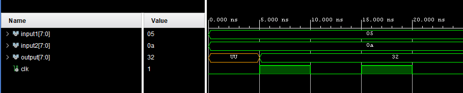

``` vhdl
library IEEE;
use IEEE.STD_LOGIC_1164.ALL;
use IEEE.NUMERIC_STD.ALL;

entity multiply is 
    Generic (
        g_WIDTH : natural := 8
    );
    Port(
        input_1     : in  std_logic_vector(g_WIDTH - 1 downto 0);
        input_2     : in  std_logic_vector(g_WIDTH - 1 downto 0);
        clk         : in  std_logic;
        output      : out std_logic_vector(g_WIDTH - 1 downto 0)
    );
end entity;

architecture Behavioral of multiply is

begin

    p_multiply  : process(clk)
    begin
        if rising_edge(clk) then
            output <= std_logic_vector(
                resize(
                    unsigned(input_1) * unsigned(input_2), g_WIDTH)
                );
        end if;
    end process;
end architecture;
```

### divide 
Modul [divide](VHDL/Designs/multiply.vhd) je dělič, vnitřně pracující se vstupy jako unsigned, s nastavitelnou velikostí. Pracuje synchronně, při nulovým jmenovatelem zachovává předchozí hodnotu. 

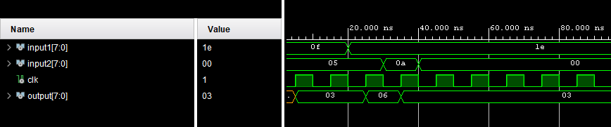

``` vhdl
library IEEE;
use IEEE.STD_LOGIC_1164.ALL;
use IEEE.NUMERIC_STD.ALL;

entity divide is
    Generic (
        g_WIDTH : natural := 8
    );
    Port(
        input_1     : in  std_logic_vector(g_WIDTH - 1 downto 0);
        input_2     : in  std_logic_vector(g_WIDTH - 1 downto 0);
        clk         : in  std_logic;
        output      : out std_logic_vector(g_WIDTH - 1 downto 0)
        
    );
end divide;

architecture Behavioral of divide is

begin
    p_multiply  : process(clk)
    begin
        if rising_edge(clk) and (unsigned(input_2) > 0) then
            output <= std_logic_vector(resize(
                unsigned(input_1) / unsigned(input_2), g_WIDTH)
                );
        end if;
    end process;

end Behavioral;

```

### decimal_to_bcd
Modul [decimal to bcd](VHDL/Designs/decimal_to_bcd) slouží jako převodník z 14 bit vstupu na 4 4bitové BCD výstupy. Výhodou jeho návrhu je, že při vstupu větším 9999 zobrazuje nejmenší 4 číslice stále bez chyby. 

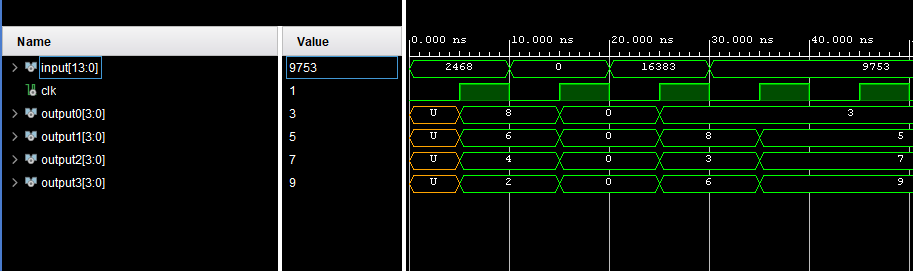


``` vhdl
library IEEE;
use IEEE.STD_LOGIC_1164.ALL;


use IEEE.NUMERIC_STD.ALL;

--library UNISIM;
--use UNISIM.VComponents.all;

entity decimal_to_bcd is
    Port (
        input       : in  std_logic_vector(14 - 1 downto 0); -- log2(9999)
        clk         : in  std_logic;
        output_0    : out std_logic_vector(4 - 1 downto 0);
        output_1    : out std_logic_vector(4 - 1 downto 0);
        output_2    : out std_logic_vector(4 - 1 downto 0);
        output_3    : out std_logic_vector(4 - 1 downto 0)
    );
end decimal_to_bcd;

architecture Behavioral of decimal_to_bcd is
begin
    decimal_to_bcd : process (clk)
    begin
        if rising_edge(clk) then
            output_0 <= std_logic_vector(resize(
                (unsigned(input) - 10*(unsigned(input)/10)), 4));
            output_1 <= std_logic_vector(resize(
                ((unsigned(input) - 100*(unsigned(input)/100))/10), 4));
            output_2 <= std_logic_vector(resize(
                ((unsigned(input) - 1000*(unsigned(input)/1000))/100), 4));
            output_3 <= std_logic_vector(resize(
                ((unsigned(input) - 10000*(unsigned(input)/10000))/1000), 4));
        end if;
    end process;
end Behavioral;

```


### clock_enable_0

Modul [clock_enable_0](VHDL/Designs/clock_enable.vhd) vytvára enable pulzy každé 4 milisekundy. To je dosiahnuté napočítaním 400000 impulzov 100 MHz interného hodinového signálu. Tieto 4 milisekundy sú potrebné pre časové multiplexovanie 7-segmentového displeja.

```vhdl
library ieee;               
use ieee.std_logic_1164.all;
use ieee.numeric_std.all;   

------------------------------------------------------------------------
-- Entity declaration for clock enable
------------------------------------------------------------------------
entity clock_enable_0 is
    generic(
        g_MAX : natural := 10      -- Number of clk pulses to generate 
                                   -- one enable signal period 
    );
     
    port(
        clk   : in  std_logic;     
        reset : in  std_logic;     
        ce_o  : out std_logic       
    );
end entity clock_enable_0;

------------------------------------------------------------------------
-- Architecture body for clock enable
------------------------------------------------------------------------
architecture Behavioral of clock_enable_0 is

    -- Local counter
    signal s_cnt_local : natural;       --local counter

begin
    --------------------------------------------------------------------
    -- p_clk_ena:
    -- Generate clock enable signal. By default, enable signal is low 
    -- and generated pulse is always one clock long.
    --------------------------------------------------------------------
    p_clk_ena : process(clk)
    begin
        if rising_edge(clk) then       

            if (reset = '1') then       
                s_cnt_local <= 0;       -- Clear local counter
                ce_o        <= '0';     -- Set output to low

            elsif (s_cnt_local >= (g_MAX - 1)) then   
                s_cnt_local <= 0;       -- Clear local counter
                ce_o        <= '1';     -- Generate clock enable pulse

            else
                s_cnt_local <= s_cnt_local + 1;
                ce_o        <= '0';
            end if;
        end if;
    end process p_clk_ena;

end architecture Behavioral;
```


### cnt_up_down

Modul [cnt_up_down](VHDL/Designs/cnt_up_down.vhd) je obojsmerný čítač. Je tu použitý ako čítač smerom hore. Jeho výstupom je informácia o tom, ktorá zo 7 segmentoviek má byť v danom čase rozsvietená. Je riadený pulzmi z modulu clock_enable_0, teda mení svoju hodnotu každé 4 milisekundy.

```vhdl
library ieee;
use ieee.std_logic_1164.all;
use ieee.numeric_std.all;

------------------------------------------------------------------------
-- Entity declaration for n-bit counter
------------------------------------------------------------------------
entity cnt_up_down_0 is
    generic(
        g_CNT_WIDTH : natural := 2    -- Number of bits for counter
    );
    port(
        clk      : in  std_logic;     
        reset    : in  std_logic;       
        en_i     : in  std_logic;       
        cnt_up_i : in  std_logic;       
        cnt_o    : out std_logic_vector(g_CNT_WIDTH - 1 downto 0)
    );
end entity cnt_up_down_0;

------------------------------------------------------------------------
-- Architecture body for n-bit counter
------------------------------------------------------------------------
architecture behavioral of cnt_up_down_0 is

    -- Local counter
    signal s_cnt_local : unsigned(g_CNT_WIDTH - 1 downto 0);  

begin
    --------------------------------------------------------------------
    -- p_cnt_up_down:
    -- Clocked process with synchronous reset which implements n-bit 
    -- up/down counter.
    --------------------------------------------------------------------
    p_cnt_up_down : process(clk)
    begin
        if rising_edge(clk) then
        
            if (reset = '1') then     
                s_cnt_local <= (others => '0'); 

            elsif (en_i = '1') then       
                s_cnt_local <= s_cnt_local + 1;
            end if;
        end if;
    end process p_cnt_up_down;

    cnt_o <= std_logic_vector(s_cnt_local);
end architecture behavioral;
```


### driver_7seg_4digits

Modul [driver_7seg_4digits](VHDL/Designs/driver_7seg_4digits.vhd) sa stará o výpis informácie na displej tvorený 4 7-segmentovkami. Tento displej je časovo multiplexovaný, každá 7-segmentovka svieti 4 milisekundy, čo robí dokopy 16 milisekúnd pre celú jednu obsluhu displeja. Týmto je dosiahnutá obnovovacia frekvencia displeja 60 Hz, čo umožňuje aby bol pozorovaný obraz plynulý. Proces `process p_mux` je multiplexer, ktorého vstup tvoria informácie o tom, ktorá 7-segmentovka má v danom čase svietiť, akú hodnotu má zobrazovať a na ktorom mieste sa nachádza desatinná bodka. Jeho funkcia je riadenie 7-segmentového displeja a prepínanie jednotlivých 7-segmentoviek. Taktiež nastavuje pozíciu desatinnej bodky.

```vhdl
library ieee;
use ieee.std_logic_1164.all;
use ieee.numeric_std.all;

------------------------------------------------------------------------
-- Entity declaration for display driver
------------------------------------------------------------------------
entity driver_7seg_4digits is
    port(
        clk     : in  std_logic;        
        reset   : in  std_logic;    
        -- 4-bit input values for individual digits    
        data_i_0 : in  std_logic_vector(4 - 1 downto 0);
        data_i_1 : in  std_logic_vector(4 - 1 downto 0);
        data_i_2 : in  std_logic_vector(4 - 1 downto 0);
        data_i_3 : in  std_logic_vector(4 - 1 downto 0);
        -- 4-bit input value for decimal points
        dp_i    : in  std_logic_vector(4 - 1 downto 0);
        -- Decimal point for specific digit
        dp_o    : out std_logic;
        -- Cathode values for individual segments
        seg_o   : out std_logic_vector(7 - 1 downto 0);
        -- Common anode signals to individual displays
        dig_o   : out std_logic_vector(4 - 1 downto 0);
        -- Colon point for specific digit 
        dig_c   : out std_logic
    );
end entity driver_7seg_4digits;

------------------------------------------------------------------------
-- Architecture declaration for display driver
------------------------------------------------------------------------
architecture Behavioral of driver_7seg_4digits is
    -- Internal clock enable
    signal s_en  : std_logic;
    -- Internal 2-bit counter for multiplexing 4 digits
    signal s_cnt : std_logic_vector(2 - 1 downto 0);
    -- Internal 4-bit value for 7-segment decoder
    signal s_hex : std_logic_vector(4 - 1 downto 0);

begin
    --------------------------------------------------------------------
    -- Instance (copy) of clock_enable entity generates an enable pulse
    -- every 4 ms
    --------------------------------------------------------------------    
    clk_en0 : entity work.clock_enable_0
        generic map(
        g_MAX  => 4
        )
        port map(
        clk    => clk,
        reset  => reset,
        ce_o   => s_en
        );
        
    --------------------------------------------------------------------
    -- Instance (copy) of cnt_up_down entity performs a 2-bit down
    -- counter
    --------------------------------------------------------------------    
    bin_cnt0 : entity work.cnt_up_down_0
        generic map(
        g_CNT_WIDTH  => 2
        )
        port map(
        clk       =>   clk,
        reset     =>   reset,
        en_i      =>   s_en,
        cnt_up_i  =>   '1',
        cnt_o     =>   s_cnt
        );

    --------------------------------------------------------------------
    -- Instance (copy) of hex_7seg entity performs a 7-segment display
    -- decoder
    --------------------------------------------------------------------    
    hex2seg : entity work.hex_7seg
        port map(
            hex_i => s_hex,
            seg_o => seg_o
        );

    --------------------------------------------------------------------
    -- p_mux:
    -- A combinational process that implements a multiplexer for
    -- selecting data for a single digit, a decimal point signal, 
    -- a colon point signal, and switches the common anodes of each 
    -- display.
    --------------------------------------------------------------------
    p_mux : process(s_cnt, data_i_0, data_i_1, data_i_2, data_i_3, dp_i)
    begin
        case s_cnt is
            when "11" =>
                s_hex <= data_i_3;
                dp_o  <= dp_i(3);
                dig_o <= "0111";
                dig_c <= '1';

            when "10" =>
                s_hex <= data_i_2;
                dp_o  <= dp_i(2);
                dig_o <= "1011";
                dig_c <= '1';

            when "01" =>
                s_hex <= data_i_1;
                dp_o  <= dp_i(1);
                dig_o <= "1101";
                dig_c <= '1';

            when others =>
                s_hex <= data_i_0;
                dp_o  <= dp_i(0);
                dig_o <= "1110";
                dig_c <= '1';
        end case;
    end process p_mux;
end architecture Behavioral;
```


### hex_7seg

Modul [hex_7seg](VHDL/Designs/hex_7seg.vhd) prekladá 4-bitovú informáciu na 7-bitovú, priamo na jednotlivé bity, ktorá už určujú, ktoré zo 7 segmentov budú svietiť.

```vhdl
library IEEE;
use IEEE.STD_LOGIC_1164.ALL;

-- Uncomment the following library declaration if using
-- arithmetic functions with Signed or Unsigned values
--use IEEE.NUMERIC_STD.ALL;

-- Uncomment the following library declaration if instantiating
-- any Xilinx leaf cells in this code.
--library UNISIM;
--use UNISIM.VComponents.all;

entity hex_7seg is
  Port 
  ( 
      hex_i  :   in	 std_logic_vector (4 - 1 downto 0); --input binary data
      seg_o  :	out	 std_logic_vector (7 - 1 downto 0)  --cathode values in the order A, B, C, D, E, F
  );
end hex_7seg;

------------------------------------------------------------------------
-- Architecture body for hex_7seg
------------------------------------------------------------------------
architecture Behavioral of hex_7seg is

begin
--------------------------------------------------------------------
    -- p_7seg_decoder:
    -- A combinational process for 7-segment display decoder. 
--------------------------------------------------------------------    
    p_7seg_decoder : process(hex_i)
    
    begin
        case hex_i is
            when "0000" =>
                seg_o <= "0000001";     -- 0
                
            when "0001" =>
                seg_o <= "1001111";     -- 1
                
            when "0010" =>
                seg_o <= "0010010";     -- 2 
                   
            when "0011" =>
                seg_o <= "0000110";     -- 3
                
            when "0100" =>
                seg_o <= "1001100";     -- 4 
                
            when "0101" =>
                seg_o <= "0100100";     -- 5    
                
            when "0110" =>
                seg_o <= "0100000";     -- 6   
                 
            when "0111" =>
                seg_o <= "0001111";     -- 7 
                   
            when "1000" =>
                seg_o <= "0000000";     -- 8  
                     
            when "1001" =>
                seg_o <= "0000100";     -- 9
             
            when "1010" =>
                seg_o <= "0001000";     -- A    
    
            when "1011" =>
                seg_o <= "1100000";     -- B      
    
            when "1100" =>
                seg_o <= "0110001";     -- C
                
            when "1101" =>
                seg_o <= "1000010";     -- D
                                
            when "1110" =>
                seg_o <= "0110000";     -- E                
                
            when others =>
                seg_o <= "0111000";     -- F
        end case;
    end process p_7seg_decoder;
end Behavioral;
```


## Popis a simulácia TOP modulu

V [top](VHDL/Designs/top.vhd) module je zobrazené celkové zapojenie cyklocomputera a stavový diagram obvodu.

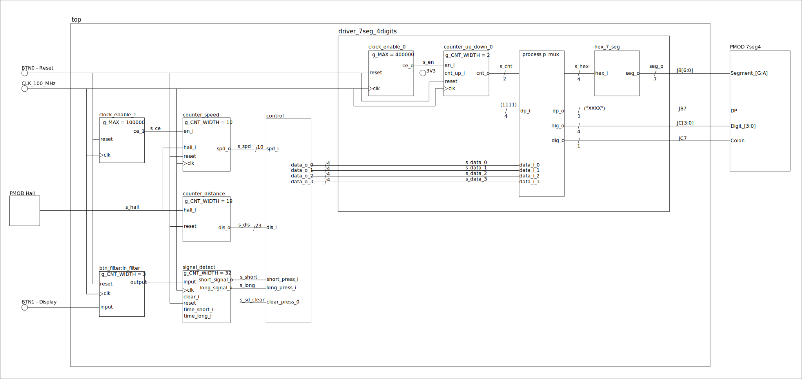

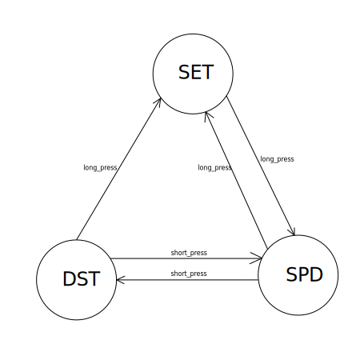

```vhdl

library IEEE;
use IEEE.STD_LOGIC_1164.ALL;

-- Uncomment the following library declaration if using
-- arithmetic functions with Signed or Unsigned values
--use IEEE.NUMERIC_STD.ALL;

-- Uncomment the following library declaration if instantiating
-- any Xilinx leaf cells in this code.
--library UNISIM;
--use UNISIM.VComponents.all;

entity top is
    Port 
    ( 
        CLK100MHZ   : in STD_LOGIC;
        BTN0        : in STD_LOGIC;
        BTN1        : in STD_LOGIC;
        PMOD_hall   : in STD_LOGIC;
--        SW1         : in STD_LOGIC;
--        SW0         : in STD_LOGIC;
        LED         : out STD_LOGIC_VECTOR (4-1 downto 0);
        AN          : out STD_LOGIC_VECTOR (8-1 downto 0);
        JB          : out STD_LOGIC_VECTOR (8-1 downto 0);
        JC          : out STD_LOGIC_VECTOR (8-1 downto 0);
        LED0_R      : out STD_LOGIC;
        LED0_G      : out STD_LOGIC;
        LED0_B      : out STD_LOGIC
    );
end top;

architecture Behavioral of top is
    -- Internal clock enable
    signal s_en  : std_logic;
    signal s_ce  : std_logic;
    -- Internal counter
    signal s_cnt : std_logic_vector(2 - 1 downto 0);
    signal s_spd : std_logic_vector(10 - 1 downto 0);
    signal s_dis : std_logic_vector(23 - 1 downto 0);
    --PMOD Hall
    signal s_hall  : std_logic;
    
    -- button input signal
    signal s_inp    : std_logic;
    
    
    signal s_short :std_logic;
    signal s_long :std_logic;
    signal s_sd_clear :std_logic;
    
    signal s_data_0 : std_logic_vector(4 - 1 downto 0);
    signal s_data_1 : std_logic_vector(4 - 1 downto 0);
    signal s_data_2 : std_logic_vector(4 - 1 downto 0);
    signal s_data_3 : std_logic_vector(4 - 1 downto 0);
begin

    -- Instance (copy) of driver_7seg_4digits entity
    driver_seg_4 : entity work.driver_7seg_4digits
        port map(
            clk        => CLK100MHZ,
            reset      => BTN0,
            
            data_i_0    => s_data_0,
            data_i_1    => s_data_1,
            data_i_2    => s_data_2,
            data_i_3    => s_data_3,
            
            
            dig_o      => JC(4-1 downto 0),
            
            seg_o      => JB(6 downto 0),
            
            dp_i  => "1111", -- dot point
            dp_o  => JB(7), --DP
            dig_c => JC(7)

        );

    -- Instance (copy) of clock_enable_1 entity
    clk_en0 : entity work.clock_enable_0
        generic map(
        
        g_MAX => 400000
        
        )
        port map(
        
           clk     =>   CLK100MHZ,
           reset   =>   BTN0,
           ce_o    =>   s_en

        );

    -- Instance (copy) of cnt_up_down entity
    bin_cnt0 : entity work.cnt_up_down_0
        generic map(
        
        g_CNT_WIDTH => 2

        )
        port map(
        
        clk        =>   CLK100MHZ,
        reset      =>   BTN0,
        en_i       =>   s_en,
        cnt_up_i   =>   '1',
        cnt_o      =>   s_cnt
        
        );


    -- Instance (copy) of clock_enable_1 entity
    clk_en1 : entity work.clock_enable_1
        generic map(
        
        g_MAX => 100000
        
        )
        port map(
        
           clk     =>   CLK100MHZ,
           reset   =>   BTN0,
           ce_1    =>   s_ce

        );
        
    -- Instance (copy) of counter_speed entity
    bin_cnt_speed : entity work.counter_speed
        generic map(
        
        g_CNT_WIDTH => 10

        )
        port map(
        
        clk        =>   CLK100MHZ,
        reset      =>   BTN0,
        en_i       =>   s_ce,
        hall_i     =>   s_hall,
        spd_o      =>   s_spd
        
        );
                
    -- Instance (copy) of counter_distance entity
    bin_cnt_distance : entity work.cnt_distance
        generic map(
        
        g_CNT_WIDTH => 23

        )
        port map(
        
        reset      =>   BTN0,
        hall_i     =>   s_hall,
        distance_o =>   s_dis
        
        );

    -- Instance (copy) of p_control
    p_control : entity work.control
        port map(

            speed_i     => s_spd,
            clk         => CLK100MHZ,
            reset_i     => BTN0,
            distance_i  => s_dis,
             
            -- press_detect interface
            short_press_i  => s_short, 
            long_press_i   => s_long,
            clear_press_o  => s_sd_clear,
            
            -- outputs
            data_o_0       => s_data_0,
            data_o_1       => s_data_1,
            data_o_2       => s_data_2,
            data_o_3       => s_data_3,
            state_o(2)     => LED0_R,
            state_o(1)     => LED0_G,
            state_o(0)     => LED0_B
        );

    p_btn : entity work.in_filter
        port map(
            input     => BTN1,
            clk       => s_ce,
            output    => s_inp

        );
    
    p_press_detect  : entity work.signal_detect
    generic map(
        g_CNT_WIDTH     => 10
        )
    port map(
        input           => s_inp,
        clk             => CLK100MHZ,
        clear_i         => s_sd_clear,
        reset_i         => BTN0,
        time_short_i    => "0001010000", -- 80ms
        time_long_i     => "0100101100", -- 300ms
        short_signal_o  => s_short,
        long_signal_o   => s_long
    );
    JC(6 downto 4) <= (others => '0');              
end Behavioral;
```


## Výsledky
Podařilo se nám vytvořit počítač vzdálenosti a rychlosti na jízdní kolo nebo rotoped. Chyba měření rychlosti je velká při pomalé jízdě (zejména <20km/h). Přepínání mezi režimy je možno spínačem BTN1, jehož signál je zpracováván jednoduchým integračním filtrem kvůli debouncingu. Je možné přepínat mezi zobrazením vzdálenosti, rychlosti a nastavením obvodu kola. Velká část projektu byla poskládána z dříve vytvořených modulů z počítačových cvičení.
Bitstream se nám bohužel vytvořit nepodařilo.


## Video

[Video](https://drive.google.com/file/d/1lW2mAQtdswHChjIZ5Rc0qnjZ2q5AomU7/view?usp=sharing)

## Referencie

   1. [Arty A7 Reference Manual](https://reference.digilentinc.com/reference/programmable-logic/arty-a7/reference-manual)
   2. [7SEG4 PMOD](http://fpga.fm4dd.com/?pmod/7seg4)
   3. [Linear Hall Effect Sensor Module](https://protosupplies.com/product/linear-hall-effect-sensor-module/)

